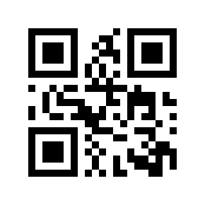

# External Interface Document

Definition of the external interface of the embedded system.

[TOC]

## 1. General Feature

To Communicate with an embedded system **#Device#**, you need to know the **#IPAndPort#** of the **#Device#** and send HTTP-POST Request to it. 

### 1.1 Demo Embedded System

There is a **#DemoEmbeddedSystem#** running on **#IP#:** `139.155.89.85`, **#Port#:**  `11451`.To call the **#DemoEmbeddedSystem#**, the following code in python can be used. The **#DemoEmbeddedSystem#** is only used during interface debugging, and it will be shutdown after `2023-06-01 UTC 20:00`.

```python
import http.client
import json

# DemoEmbeddedSystem: IP, Port
SERVER_IP   = "139.155.89.85"
SERVER_PORT = 11451

def makeError(msg):
    return {"type"   : "Error", "message": str(msg)}

# Send a JsonData HTTP-POST request to (serverIP, serverPort)
def clientRequest(data: dict, serverIP: str, serverPort: int):
    assert type(data)       == dict
    assert type(serverIP)   ==  str
    assert type(serverPort) ==  int
    conn = http.client.HTTPConnection("%s:%d" % (serverIP, serverPort))
    jsonData = json.dumps(data)
    headers = {
        "Content-Type": "application/json"
    }
    try:
        conn.request("POST", "/", jsonData, headers)
        response = conn.getresponse()
        body = response.read().decode()
    except:
        body = None
    if body is None: return makeError("CanNotConnectToServer")
    # try to make it json
    try:    body = json.loads(body)
    except: body = None
    # return if it is json
    if body is not None: return body
    else:                return makeError("ServerResponseIsNotJson")
    
# "dataNow" is the JSON data to send, "ret" is the response from EmbeddedSystem
dataNow = {
    "type": "GetRealtimeData"
}
ret = clientRequest(dataNow, SERVER_IP, SERVER_PORT)
print(ret)
```

### 1.2 About the QR code
In the second round of demand analysis, Party A suggested that our Android App use code scanning for device binding. Here is the QR code of the demo embedded device.



## 2. Request Types

In the JSON data (sent to the **#EmbeddedSystem#**), there should always be an string **#JsonAttribute#** called `type`, otherwise the **#EmbeddedSystem#** will response as follows.

```json
{
    "type": "Error",
    "message": "AttrTypeUndefined"
}
```

There are four available values for the **#JsonAttribute#** `type`: `GetRealtimeData`, `GetSensorStatus`, `SensorCalibration`, `GetSensorDetails`.

### 2.1 "type":"GetRealtimeData" 

Request:

```json
{
    "type":"GetRealtimeData"
}
```

Response Structure (**#MotionFrame#**):

```json
{
    "type": "GetRealtimeDataResponse",
    "timestamp":0.0,
    "L1":{
        "X"   : 0.0, "Y"   : 0.0, "Z"   : 0.0,
        "accX": 0.0, "accY": 0.0, "accZ": 0.0,
        "asX" : 0.0, "asY" : 0.0, "asZ" : 0.0
    },
    "L2":{
        ...
    },
    "L3":{
        ...
    },
    "R1":{
        ...
    },
    "R2":{
        ...
    },
    "R3":{
        ...
    },
}
```

`L1, L2, L3` represent the three sensors on the left leg, `R1, R2, R3` represent the three sensors on the right leg. **#JsonAttribute#** `timestamp` shows when the **#MotionFrame#** is collected (The number of milliseconds since January 1, 1970.).  The inner data structures of **#JsonAttribute#** `L2, L3, R1, R2, R3` are the same with the inner data structure of `L1`.

> **Warning:**  Value `"0.0"` above will be replaced by the collected #**MotionFrame**#, while the **#DemoEmbeddedSystem#** will not replace it.

### 2.2 "type":"GetSensorStatus"

Request:

```json
{
    "type":"GetSensorStatus"
}
```

*Response Format*

```json
{
    "type": "GetSensorStatusResponse",
    "L1":{
        "connect": true,
        "battery": 100
    },
    "L2":{
        "connect": true,
        "battery": 100
    },
    "L3":{
        "connect": true,
        "battery": 100
    },
    "R1":{
        "connect": true,
        "battery": 100
    },
    "R2":{
        "connect": true,
        "battery": 100
    },
    "R3":{
        "connect": true,
        "battery": 100
    }
}
```

### 2.3 "type":"SensorCalibration"

Request:

```json
{
    "type":"SensorCalibration"
}
```

Response (If calibrated successfully):

```json
{
    "type":"CalibrationSuccess"
}
```

otherwise:

```json
{
    "type":"CalibrationFailure"
}
```

> Tips: **Why calibration may fail?** Calibration requires time, and if the previous calibration is not yet complete, the embedded system will feedback a calibration failure when receiving a second calibration request.

### 2.4 "type":"GetSensorDetails"

Request:

```json
{
    "type":"GetSensorDetails"
}
```

Response:

```json
{
    "type":"GetSensorDetailsResponse"
    "L1":{
        "name": "WT901BLE68",
        "macAddr": "D7:0F:4F:1D:4F:B5"
    },
    "L2":{
        ...
    },
    "L3":{
        ...
    },
    "R1":{
        ...
    },
    "R2":{
        ...
    },
    "R3":{
        ...
    }
}
```

The inner data structures of **#JsonAttribute#** `L2, L3, R1, R2, R3` are the same with the inner data structure of `L1`.

### 2.5 "type":"Ping"

Request:

```json
{
    "type":"Ping"
}
```

Response:

```json
{
    "type"   : "PingResponse",
    "message": "ConnectToEmbeddedSystemSuccessfully"
}
```


## 3. Appendix

| DataName                              | Data Definitions                                             |
| :------------------------------------ | :----------------------------------------------------------- |
| **#Device#**                          | The combination of a Raspberry Pi and six sensors.           |
| **#DemoEmbeddedSystem#**              | A virtual **#Device#** with a complete interface of **#EmbeddedSystem#**,  but the data is fabricated. |
| **#IP#**、**#Port#**、**#IPAndPort#** | To simplify the design, we assume that each **#Device#** corresponds to a unique (IP, Port) pair. |
| **#JsonAttribute#**                   | The keys that define the attributes or characteristics of the object, and their corresponding values representing the values of those attributes or characteristics. |
| **\#MotionFrame#**                    | A snapshot of motion data captured by the six sensors at the same time. This data includes information such as acceleration, velocity, displacement and a timestamp. |

