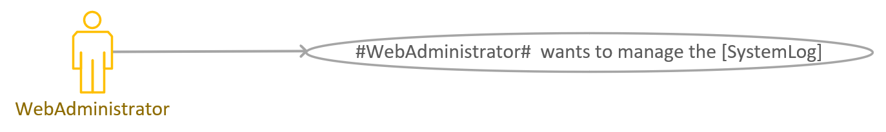
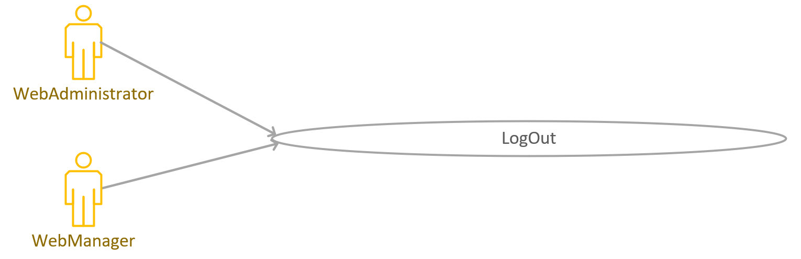

# Software Requirement Specification
[TOC]
## 1. Introduction

### 1.1 Compilatory Purpose

This document is compiled for 'Motion Prediction (MoPre)', which is a software system to predict the user's motion intention in the future time interval.

### 1.2 Document Conventions

- Every term between two sharp symbol "**#**" (like **#AndriodApp#**) can be found in section "Explanation of Terms" in the Appendix.
- Symbols in the Data Definitions
    - The plus operator "`[A]=B+C`" means Data `A` consists of Attribute `B` and Attribute `C`.

    - The brackets in `"(A)"` means Attribute `A` is an optional attribute (appears zero time or one time). 

    - The braces in `"{A}i"` means Attribute `A` will repeat in this data for exactly `i` times where `i` is an integer.

    - The braces (without an integer `i` after it) in `"{A}"`  means Attribute `A` will repeat for zero or more times.

### 1.3 Potential Readers
- **#Customer#**: **#AndroidAppUser#** (or **#AndroidAppVisitor#**), the one who uses a **#Device#** will login with the android app to collect data from a **#Device#**. **#AndroidAppVisitor#** refers to users who have not yet logged in.
- **#SystemAdministrator#**: User of **#WebApp#**, including **#WebAdministrator#** and **#WebManager#**, the administrator will use the **#WebApp#** as a dashboard to check and **#ManageTheWholeSystem#**.
- Party A: The one who raised the target, played by Prof. Zhang.

### 1.4 Product Scope

The **#Software#** should have below functions.
- Track the motion of users using 6-axis sensors, bind to legs, to form a labeled dataset of human motions. These data are collected using Bluetooth; 
- Train a generalization model to predict human motions in general (via the dataset); 
- Provide a specialized model to predict the personal intention of a real-world user, with a relatively small number of new-coming motions tracked at run-time. 

### 1.5 References
- Concept of Operation
- The Requirement analysis document for **#AndroidAppTeam#**
- The Requirement analysis document for **#WebTeam#**

## 2. User Story

### 2.1 User Stories for the **#AndroidAppUser#**

#### 2.1.1 Use Case Diagram for **#Customer#**

#### 2.1.2 Main user stories and corresponding main use cases

#### 2.1.3 The secondary use cases

### 2.2 User Stories for the User of **#WebApp#**

#### 2.2.1 Use Case Diagram for **#SystemAdministrator#**

#### 2.2.2 Main user stories and corresponding main use cases

The main purpose of the user of **#WebApp#** is listed as follows:

|User Story|Main Use Cases|
|-|-|
|As an **#SystemAdministrator#** (**#WebAdministrator#** and **#WebManager#**) of the **#Software#**, I want to view, modify the binding relationship between **#AndroidApp#** users and **#Device#**s.|(1) Case: **#SystemAdministrator#** wants to view the list of **#Device#**s|
|As an **#SystemAdministrator#** (**#WebAdministrator#** and **#WebManager#**) of the **#Software#**, I want to manage **#AndroidAppUser#**'s **[RegisterInformation]**.|(2) Case: **#SystemAdministrator#** wants to manage **[RegisterInformation]**|
|As an **#SystemAdministrator#** (**#WebAdministrator#** and **#WebManager#**) of the **#Software#**, I want to view the historical **[data]**.|(3) Case: **#SystemAdministrator#** wants to view the historical **[MotionRecord]**.|
|As an **#WebAdministrator#**of the **#Software#**, I want to manage the **[SystemLog]**.|(4) Case: **#WebAdministrator#**  wants to manage the **[SystemLog]**.|
|As an **#WebAdministrator#**of the **#Software#**, I want to manage the **#Manager#** information.|(5) Case: **#WebAdministrator#**  wants to manage the **#WebManager#** information.|

The detailed description of the main use cases.

- **(1) Case: #SystemAdministrator# wants to view the list of #Device#s**

  
  
  | **Brief Introduction**                                       | **Actors**                | **Pre-Conditions**                    |
  | ------------------------------------------------------------ | ------------------------- | ------------------------------------- |
  | The **#SystemAdministrator#** is able to access list of the **#Device#**s which are connecting with the **#System#**. | **#SystemAdministrator#** | The **#WebApp#** is open and running. |
  
  | Basic Flow | Actor                                                        | System                                       |
  | ---------- | ------------------------------------------------------------ | -------------------------------------------- |
  | 1          | The **#SystemAdministrator#** hovers his mouse over the **#Device#**s key. |                                              |
  | 2          |                                                              | **#WebApp#** shows list of the **#Device#**s |
  
  > **Post Conditions**: **#SystemAdministrator#** obtains the list of **#Device#**s.
  
- **(2) Case: #SystemAdministrator# wants to manage [RegisterInformation]**

  
  
  | **Brief Introduction**                                       | **Actors**                | **Pre-Conditions**                    |
  | ------------------------------------------------------------ | ------------------------- | ------------------------------------- |
  | The **#SystemAdministrator#** is able to manage **[RegisterInformation]** of the **#AndroidAppUser#**s. | **#SystemAdministrator#** | The **#WebApp#** is open and running. |
  
  | **Basic Flow** | Actor                                                        | System                                                       |
  | -------------- | ------------------------------------------------------------ | ------------------------------------------------------------ |
  | 1              | The **#SystemAdministrator#** hovers his mouse over the users management key. |                                                              |
  | 2              |                                                              | Web page shows **[RegisterInformation]** and the add, delete, revise, import and derive keys. |
  | 3              | **#SystemAdministrator#** views **[RegisterInformation]** and manage **[RegisterInformation]**. |                                                              |
  
  > **Post Conditions**: **#SystemAdministrator#** can manage the  **#AndroidAppUser#**'s **[RegisterInformation]**.

- **(3) Case: #SystemAdministrator# wants to view the historical [MotionRecord]**

    

    | **Brief Introduction**                                       | **Actors**                | **Pre-Conditions**                    |
    | ------------------------------------------------------------ | ------------------------- | ------------------------------------- |
    | The **#SystemAdministrator#** is able to access historical **[MotionRecord]**. | **#SystemAdministrator#** | The **#WebApp#** is open and running. |

    | **Basic Flow** | Actor                                                        | System                                                       |
    | -------------- | ------------------------------------------------------------ | ------------------------------------------------------------ |
    | 1              | The **#SystemAdministrator#** hovers his mouse over the history key. |                                                              |
    | 2              | The **#SystemAdministrator#** inputs the **[AccountNumber]** to search the **[MotionRecord]** from the **#System#**. |                                                              |
    | 3              |                                                              | **#WebApp#**  provides the every **[MotionRecord]**’s create time to be chosen by **#SystemAdministrator#**. |
    | 4              | The **#SystemAdministrator#** chooses the time they want to know. |                                                              |
    | 5              |                                                              | **#WebApp#** shows the line chart for next 5 frames i.e. 9 attributes of the sensors. |
    | 6              | The **#SystemAdministrator#** chooses to delete the history **[MotionRecord]**. |                                                              |
    
    | Exception Flow    | Actor                                                        | System                                                       |
    | ----------------- | ------------------------------------------------------------ | ------------------------------------------------------------ |
    | From basic flow 5 |                                                              |                                                              |
    | 6                 | The **#SystemAdministrator#** clicks last key.               | **#WebAPP# **shows the last 5 frames.                        |
    | From basic flow 5 |                                                              |                                                              |
    | 7                 | The **#SystemAdministrator#** clicks next key.               | **#WebAPP# **shows the next 5 frames.                        |
    | From basic flow 5 |                                                              |                                                              |
    | 8                 | The **#SystemAdministrator#** can choose the create time again. | **#WebAPP# **turns to the basic flow 5.                      |
    | From basic flow 6 |                                                              |                                                              |
    |                   |                                                              | If the **[MotionRecord]** is successfully deleted, the page is returned. |
    |                   |                                                              | If the **[MotionRecord]** is failed to delete, **#WebAPP#** prompts for deletion failed. |
    
    
    > **Post Conditions**: **#SystemAdministrator#** can view the historical and real-time **[MotionRecord]** and delete historical **[MotionRecord]**.

- **(4) Case: #SystemAdministrator#  wants to manage the [SystemLog]**

    

    | **Brief Introduction**                                       | **Actors**             | **Pre-Conditions**                    |
    | ------------------------------------------------------------ | ---------------------- | ------------------------------------- |
    | The **#WebAdministrator#** is able to  manage the **[SystemLog]**. | **#WebAdministrator#** | The **#WebApp#** is open and running. |

    | **Basic Flow** | Actor                                                        | System                                                       |
    | -------------- | ------------------------------------------------------------ | ------------------------------------------------------------ |
    | 1              | The **#WebAdministrator#** hovers his mouse over the log management key. |                                                              |
    | 2              |                                                              | **#WebApp#** shows the the list of the **[SystemLog]**.      |
    | 3              | **#WebAdministrator#** clicks the set key.                   |                                                              |
    | 4              | **#WebAdministrator#** can revise or delete the log.         | If the **#WebAdministrator#** successfully revises or deletes the **[SystemLog]**, the page is returned. If the **#WebAdministrator#** fails to delete, **#WebApp#** prompt for deletion failed. |
    | 5              | **#WebAdministrator#** clicks the reserve button to reserve the **[SystemLog]**. | If the **#WebAdministrator#** successfully reserves the **[SystemLog]**, the page is returned. If the **#WebAdministrator#** fails to delete, **#WebApp#** prompt for deletion failed. |

    > **Post Conditions**: **#WebAdministrator#** can manage the **[SystemLog]**s.

- **(5) Case: #WebAdministrator#  wants to manage the #WebManager#'s information**

    

    | **Brief Introduction**                                       | **Actors**             | **Pre-Conditions**                              |
    | ------------------------------------------------------------ | ---------------------- | ----------------------------------------------- |
    | The **#WebAdministrator#** is able to  manage the **#WebManager#** information. | **#WebAdministrator#** | The **#WebApp#** management web page is opened. |

    | **Basic Flow** | Actor                                                        | System                                                       |
    | -------------- | ------------------------------------------------------------ | ------------------------------------------------------------ |
    | 1              | The **#WebAdministrator#** hovers his mouse over the **#WebManager#** management key. |                                                              |
    | 2              |                                                              | Web page shows **[ManagerInformation]** and the add, delete, revise, import and derive keys. |
    | 3              | **#WebAdministrator#** views **[ManagerInformation]**and manage **[ManagerInformation]**. |                                                              |

    > **Post Conditions**:  **#WebAdministrator#** can manage the  **#WebManager#**'s **[ManagerInformation]**.
#### 2.2.3 The secondary use cases

- **(6) Case: Login**

    

    | **Brief Introduction**                                      | **Actors**                | **Pre-Conditions**                    |
    | ----------------------------------------------------------- | ------------------------- | ------------------------------------- |
    | Allow **#SystemAdministrator#** to log in the **#WebApp#**. | **#SystemAdministrator#** | The **#WebAPP#** is open and running. |

    | Basic Flow | Actor                                                        | System                                 |
    | ---------- | ------------------------------------------------------------ | -------------------------------------- |
    | 1          | **#SystemAdministrator#** inputs **[AccountNumberAndPassword]** |                                        |
    | 2          |                                                              | Show a successful notion               |
    | 3          |                                                              | **#WebAPP#** turns into the main page. |

    | Exception Flow | Actor | System                                                       |
    | -------------- | ----- | ------------------------------------------------------------ |
    |                |       | From basic flow 1                                            |
    | 4              |       | Inform **#SystemAdministrator#** that he or she has input an **[AccountNumber]** that does not exists or a wrong **[Password]**. |

    > **Post Conditions**: **#SystemAdministrator#**'s **[AccountNumberAndPassword]** is stored.

- **(7) Case: LogOut**  

    

    | **Brief Introduction**                       | **Actors**                | **Pre-Conditions**                                        |
    | -------------------------------------------- | ------------------------- | --------------------------------------------------------- |
    | **#SystemAdministrator#** wants to logs out. | **#SystemAdministrator#** | **#SystemAdministrator#** has logged in the **#WebApp#**. |

    | **Basic Flow** | Actor                                                 | System                                  |
    | -------------- | ----------------------------------------------------- | --------------------------------------- |
    | 1              | **#SystemAdministrator#** clicks the “log out” button |                                         |
    | 2              |                                                       | The **#WebApp#** turns to visitor page. |

## 3.Appendix

### 3.1 Explanation of Terms
| Term                       | Explanation                                                  |
| -------------------------- | ------------------------------------------------------------ |
| **#AndroidApp#**           | An android application for **#Customer#**.           |
| **#AndroidAppTeam#**       | A synonym for "**Dreamweaver-GUI Team**".                    |
| **#AndroidAppUser#** | User of **#AndroidApp#**, who has logged in. |
| **#AndroidAppVisitor#** | User of **#AndroidApp#**, who has not logged in. |
| **#DataList#** | List of **[MotionRecord]**s of  **#AndroidAppUser#**. |
| **#Device#**               | A raspberry pi with six sensors, each **#Device#** will have a **FIXED** **[IPAddress]** and **[Port]** so that it can be accessed from the Internet if the **#Device#** is powered on. |
| **#ManageTheWholeSystem#** | View, modify the binding relationship between users and **#Device#**s, manage user information and issue notifications. |
| **#MotionData#** | Data recorded by users through the **#AndroidApp#** |
| **#MotionPrediction#** | The real-time predictions displayed by **#AndroidApp#** using the trained model according to the current **#MotionData#**. |
| **#RA#**                   | Short for "**Requirement Analysis**", which is a synonym for "**Software Requirement Specification**". |
| **#ServerProgram#**        | A program which will keep running 24hours a day.             |
| **#Software#**             | Refer to the software system 'Motion Prediction (MoPre)'.    |
| **#System#**               | Same as **#Software#**                                       |
|**#SystemAdministrator#**|User of **#WebApp#**, the administrator will use the **#WebApp#** as a dashboard to check and **#ManageTheWholeSystem#**.|
|**#WebAdministrator#**|The one who manages the entire **#WebApp#**, including the management of **#AndroidAppUser#**, **#WebManager#** and access to various data.|
| **#WebApp#**               | A web site for the **#SystemAdministrator#**.                     |
| **#WebManager#** | The one who can just manage the **#AndroidAppUser#** and **#TrainedData#**. |
| **#WebTeam#**              | A synonym for "**mvps Team**".                               |

### 3.2 Data Definition

| Data                | Definition                                                         |
| ------------------------------ | ------------------------------------------------------------ |
| **[AccountInformation]**       | = AccountNumber + (PhoneNumber) + (EmailAddress) + (Birthday) |
| **[AccountNumber]**           | A non-empty string consists of digits `"0-9"`, Latin letters `"a-z, A-Z"` and underscore `"_"`. |
| **[AccountNumberAndPassword]** | = AccountNumber + Password                                   |
| **[DeviceIdentifier]**         | = IPAddress+ Port                  |
| **[DeviceInformation]**        | = DeviceIdentifier + {SensorInformation}6                    |
| **[DeviceStatus]**             | = {SensorStatus}6                                            |
| **[InitialTimestamp]**        | A Timestamp, used to mark the beginning time of a motion record. |
| **[IPAddress]**               | A string consists of digits and dot `"."`.                   |
| **[ManagerInformation]** | = AccountNumber + Password + (PhoneNumber) + (EmailAddress) + (Birthday) |
| **[ModelInfo]**                | = modelflag + acc                                            |
| **[MotionFrame]**              | = {X + Y + Z + asX + asY + asZ + accX + accY + accZ}9 + Timestamp.  `X, Y, Z, asX, asY, asZ, accX, accY, accZ` are nine real numbers provided by the embedded system. |
| **[MotionRecord]**             | = AccountNumber + InitialTimestamp + MotionTag + {MotionFrame} |
| **[MotionTag]**               | An integer between 0 and 6, including 0 and 6. `0` represents `'Sit'`, `1` represents `'Stand'`, `2` represents `'Go straight'`, `3` represents `'Go uphill/upstairs'`, `4` represents `'Go downhill/dwonstairs'`, `5` represents `'Go left'`, and `6` represents `'Go right'`.     |
| **[Password]**                | A non-empty string. The **#AndroidApp#** SHOULD assure that the password is "legal" so that the other team will just regard it as a string. |
| **[Port]**                    | An integer not less than zero.                               |
| **[RegisterInformation]**      | = AccountNumber + Password + (PhoneNumber) + (EmailAddress) + (Birthday) |
| **[SensorBattery]**           | A non-negative integer which is not greater than 100.        |
| **[SensorInformation]**        | = MACAddress + Name                                          |
| **[SensorList]**               | = {SensorInformation}6                                       |
| **[SensorOnlineStatus]**      | An integer, where `0` represents the sensor is offline, and `1` represents the sensor is online. |
| **[SensorStatus]**             | = SensorOnlineStatus + SensorBattery                         |
| **[SystemLog]** | = Operator + Behavior + ReviseDate |
| **[Timestamp]**                | An integer, representing milliseconds from `1970-01-01 00:00`. |