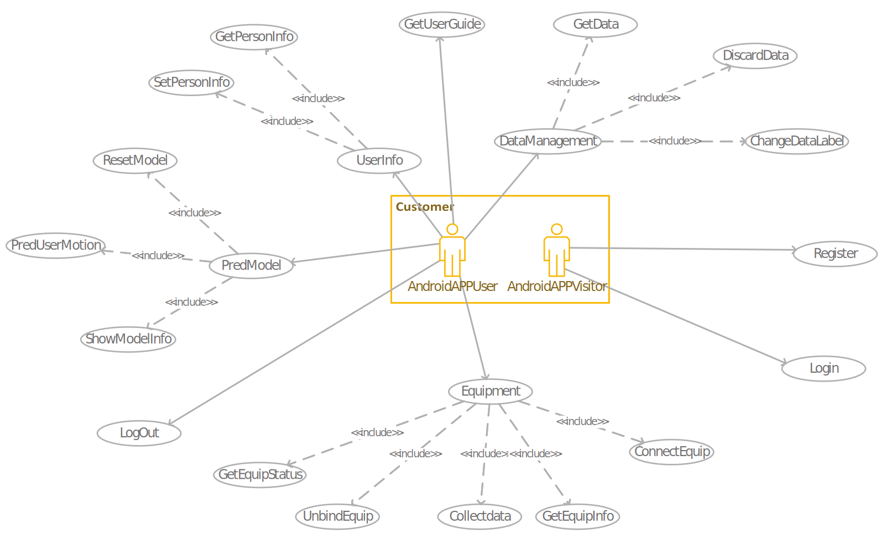
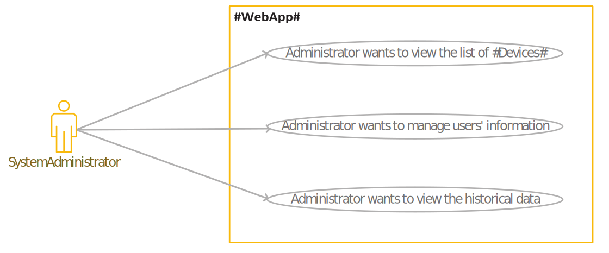

# Software Requirement Specification
[TOC]
## 1. Introduction

### 1.1 Compilatory Purpose

This document is compiled for 'Motion Prediction (MoPre)', which is a software system to predict the user's motion intention in the future time interval.

### 1.2 Document Conventions

- Every term between two sharp symbol "**#**" (like **#AndriodApp#**) can be found in section "Explanation of Terms" in the Appendix.
- Symbols in the Data Definitions
    - The plus operator "`[A]=B+C`" means Data `A` consists of Attribute `B` and Attribute `C`.

    - The brackets in `"(A)"` means Attribute `A` is an optional attribute (appears zero time or one time). 

    - The braces in `"{A}i"` means Attribute `A` will repeat in this data for exactly `i` times where `i` is an integer.

    - The braces (without an integer `i` after it) in `"{A}"`  means Attribute `A` will repeat for zero or more times.

### 1.3 Potential Readers
- **#Customer#**: **#AndroidAppUser#** (or **#AndroidAppVisitor#**), the one who uses a **#Device#** will login with the android app to collect data from a **#Device#**. **#AndroidAppVisitor#** refers to users who have not yet logged in.
- **#SystemAdministrator#**: User of **#WebApp#**, the administrator will use the **#WebApp#** as a dashboard to check and **#ManageTheWholeSystem#**.
- Party A: The one who raised the target, played by Prof. Zhang.

### 1.4 Product Scope

The **#Software#** should have below functions.
- Track the motion of users using 6-axis sensors, bind to legs, to form a labeled dataset of human motions. These data are collected using Bluetooth; 
- Train a generalization model to predict human motions in general (via the dataset); 
- Provide a specialized model to predict the personal intention of a real-world user, with a relatively small number of new-coming motions tracked at run-time. 

### 1.5 References
- Concept of Operation
- The Requirement analysis document for **#AndroidAppTeam#**
- The Requirement analysis document for **#WebTeam#**

## 2. User Story

### 2.1 User Stories for the **#AndroidAppUser#**

#### 2.1.1 Use Case Diagram for #Customer#

#### 2.1.2 Main user stories and corresponding main use cases
The main purposes of the **#AndroidAppUser#** are listed as follows:

|User Story|Main Use Cases|
|-|-|
|As a **#Customer#**, I want to use model to give real-time predictions based on my current **#MotionData#**.|(1) Case: PredUserMotion|
|As a **#Customer#**, I want to record my **#MotionData#** into **[MotionRecord]**.|(2) Case: CollectData  |
|As a **#Customer#**, I want to acquire a trained model from my recorded **#MotionData#**.|*Included in (1) PredUserMotion, no user operation is required*|

The detailed description of the main use cases：

- (1) Case: PredUserMotion

  **Brief Introduction**: Use trained model and real-time monitoring data, to give real-time predictions and **#AndroidApp#** shows the result, until **#AndroidAppUser#** stops

  **Actors**: **#AndroidAppUser#**

  **Pre-Conditions**: **#AndroidApp#** has changed to Model mode

  **Basic Flow**

  |      | Actor                                   | System                  |
  | ---- | --------------------------------------- | ----------------------- |
  | 1    | **#AndroidAppUser#** click "PredUserMotion" button |                         |
  | 2    |                                         | **#AndroidApp#** shows the **[MotionTag]** |
  | 3    | **#AndroidAppUser#** click "end" button                 |                         |
  | 4    |                                         | **#AndroidApp#** releases connection |

  **Exception Flow**

  |      | Actor | System                                                       |
  | ---- | ----- | ------------------------------------------------------------ |
  | 2.2  |       | If **#AndroidApp#** receives error information, **#AndroidApp#** shows the error notion, and back to Equip mode |
  | 2.3  |       | If **#AndroidApp#** waits more than time limitation, **#AndroidApp#** shows the error notion, and back to Equip mode |

  **Post Condition**

  **#AndroidApp#** gets the result(**[MotionTag]**)

- (2) Case: CollectData

  **Brief Introduction**: **#AndroidApp#** requests to begin and end getting data, and **#System#** saves the data.

  **Actors**: **#AndroidAppUser#**

  **Pre-Conditions**: **#AndroidApp#** has changed into Equip mode

  **Basic Flow**

  |      | Actor                            | System                                                 |
  | ---- | -------------------------------- | ------------------------------------------------------ |
  | 1    | **#AndroidAppUser#** click "Collect Data" button |                                                        |
  | 2    |                                  | **#AndroidApp#** shows the **[MotionTag]**, and wait **#AndroidAppUser#** to choose |
  | 3    | **#AndroidAppUser#** choose one **[MotionTag]**  |                                                        |
  | 4    | **#AndroidAppUser#** click "Finish Data" button  |                                                        |
  | 5    |                                  | **#AndroidApp#** shows successful notion                            |

  **Exception Flow**

  |      | Actor | System                                                       |
  | ---- | ----- | ------------------------------------------------------------ |
  | 5.2  |       | If **#AndroidApp#** receives error information, **#AndroidApp#** shows error notion and back to Equip mode |

  **Post Condition**

  Data has collected and saved

#### 2.1.3 The secondary use cases

- (3) Case: Login

  **Brief Introduction**: Allow **#AndroidAppVisitor#** to log in the **#AndroidApp#** and use functions.

  **Actors**: **#AndroidAppVisitor#**

  **Pre-Conditions**: The **#AndroidApp#** is running.

  **Basic Flow**

  | Basic Flow | Actor                                     | System                   |
  | ---------- | ----------------------------------------- | ------------------------ |
  | 1          | **#AndroidAppVisitor#** input **[AccountNumberAndPassword]** |                          |
  | 2          |                                           | Show a successful notion |
  | 3          |                                           | Become **#AndroidAppUser#**      |

  **Exception Flow**
  
  | Exception Flow | Actor | System                                                       |
  | -------------- | ----- | ------------------------------------------------------------ |
  |                |       | From basic flow 1                                            |
  | 4              |       | Inform visitor that he or she has input a **[AccountNumber]** that not exists or a wrong **[Password]**. |
  
  **Post Conditions**
  
  **#AndroidAppUser#** information (**[AccountNumberAndPassword]**) is stored.
  
- (4) Case: Register

  **Brief Introduction**
  
  Register **#AndroidAppUser#**
  
  **Actors**
  
  **#AndroidAppVisitor#**
  
  **Pre-Conditions**
  
  **#AndroidAppVisitor#** has launched App.
  
  **Basic Flow**
  
  | Basic Flow | Actor                           | System                                                 |
  | ---------- | ------------------------------- | ------------------------------------------------------ |
  | 1          | **#AndroidAppVisitor#** inputs **[AccountNumber]** |                                                        |
  | 2          |                                 | **#AndroidApp#** checks whether **[AccountNumber]** is legal |
  | 3          | **#AndroidAppVisitor#** inputs **[Password]** |                                                        |
  | 4          |                                 | **#AndroidApp#** checks whether **[Password]** is legal     |
  | 5          | **#AndroidAppVisitor#** reinputs **[Password]** |                                                        |
  | 6          |                                 | **#AndroidApp#** checks whether the two **[Password]**s are same |
  | 7          | **#AndroidAppVisitor#** inputs **[RegisterInformation]** except **[AccountNumberAndPassword]** |                                                        |
  | 8          |                                 | **#AndroidApp#** checks whether the **[RegisterInformation]** except **[AccountNumberAndPassword]** is legal |
  | 9         |                                 | **#AndroidApp#** shows successful notion and **[AccountNumber]** |
  
  **Exception Flow**
  
  | Exception Flow | Actor | System                                                       |
  | -------------- | ----- | ------------------------------------------------------------ |
  | 2.2            |       | If **[AccountNumber]** is not legal, shows mistake notion and back to step 1 |
  | 4.2            |       | If **[Password]** is not legal, shows mistake notion and back to step 3 |
  | 6.2            |       | If **[Password]** is different, shows mistake notion and back to step 5 |
  | 8.2            |       | If **[RegisterInformation]** except **[AccountNumberAndPassword]** is not legal, shows mistake notion and back to step 7 |
  | 9.2            |       | If **#AndroidApp#** receives error information, **#AndroidApp#** shows the error notion. |
  | 9.3            |       | If **#AndroidApp#** waits more than time limitation, **#AndroidApp#** shows the error notion. |
  
  **Post Conditions**
  
  An account is registered.

- (5) Case: LogOut  

  **Brief Introduction**

  **#AndroidAppUser#** log out

  **Actors**

  **#AndroidAppUser#**

  **Pre-Conditions**

  A **#AndroidAppUser#** has logged in the **#AndroidApp#**.

  **Basic Flow**

  |      | Actor                           | System                                    |
  | ---- | ------------------------------- | ----------------------------------------- |
  | 1    | **#AndroidAppUser#** click the “log out” button |                                           |
  | 2    |                                 | The **#AndroidApp#** turn to visitor mode |

- (6) Case: UserInfo  

  **Brief Introduction**

  **#AndroidAppUser#** choose to do something with personal information.and change to user information mode.

  **Actors**

  **#AndroidAppUser#**

  **Pre-Conditions**

  **#AndroidAppUser#** has logged in the **#AndroidApp#**.

  **Basic Flow**

  |      | Actor                                     | System                             |
  | ---- | ----------------------------------------- | ---------------------------------- |
  | 1    | **#AndroidAppUser#** click the “User Information” button. |                                    |
  | 2    |                                           | Jump to User Information interface |

- (7) Case: GetPersonInfo  

  **Brief Introduction**

  Get the personal information set before.

  **Actors**

  **#AndroidAppUser#**

  **Pre-Conditions**

  **#AndroidAppUser#** choose the “user information” button.

  **Basic Flow**

  |      | Actor                                        | System                                          |
  | ---- | -------------------------------------------- | ----------------------------------------------- |
  | 1    | **#AndroidAppUser#** choose to get **[AccountInformation]**. |                                                 |
  | 3    |                                              | Display **[AccountInformation]** on the screen. |

- (8) Case: SetPersonInfo  

  **Brief Introduction**

  Add personal information.

  **Actors**

  **#AndroidAppUser#**

  **Pre-Conditions**

  **#AndroidAppUser#** choose the “user information” button.

  **Basic Flow**

  |      | Actor                                                        | System                               |
  | ---- | ------------------------------------------------------------ | ------------------------------------ |
  | 1    | **#AndroidAppUser#** choose to set **[AccountInformation]**.                 |                                      |
  | 2    | **#AndroidAppUser#** input **[AccountInformation]** except **[AccountNumber]** |                                      |
  | 3    |                                                              | Display successful notion on screen. |

  **Exception Flow**

  |      | Actor | System                                                       |
  | ---- | ----- | ------------------------------------------------------------ |
  | 1    |       | The Exception Flow begins after step 3 of the main flow      |
  | 2    |       | The **#AndroidApp#** informed the **#AndroidAppUser#** that he or she has input invalid information. |

  **Post Conditions**

  New **[AccountInformation]** has been added.

- (9) Case: Equipment  

  **Brief Introduction**

  The **#AndroidAppUser#** who have auxiliary walking tools choose to bind the tools with **#AndroidApp#** to get better prediction.

  **Actors**

  **#AndroidAppUser#**

  **Pre-Conditions**

  A **#AndroidAppUser#** has logged in.

  **Basic Flow**

  |      | Actor                            | System                       |
  | ---- | -------------------------------- | ---------------------------- |
  | 1    | **#AndroidAppUser#** click the equipment button. |                              |
  | 2    |                                  | Jump to equipment interface. |

- (10) Case: ConnectEquip  

  **Brief Introduction**

  **#AndroidAppUser#** input the IP address and port of the equipment, and the **#System#** saves this.

  **Actors**

  **#AndroidAppUser#**

  **Pre-Conditions**

  **#AndroidApp#** has changed into Equipment mode

  **Basic Flow**

  |      | Actor                                      | System                                                       |
  | ---- | ------------------------------------------ | ------------------------------------------------------------ |
  | 1    | **#AndroidAppUser#** Click "ConnectEquip" button           |                                                              |
  | 2    |                                            | **#AndroidApp#** shows the textbox, and wait **#AndroidAppUser#** to input **[IPAddress]** and **[Port]** |
  | 3    | **#AndroidAppUser#** inputs **[IPAddress]** and **[Port]** |                                                              |
  | 4    |                                            | **#AndroidApp#** checks whether the input contents are legal and shows successful notion |

  **Exception Flow**

  |      | Actor | System                                                       |
  | ---- | ----- | ------------------------------------------------------------ |
  | 4.2  |       | If the **[IPAddress]** or the **[Port]** is illegal, **#AndroidApp#** shows the mistake notion, and back to step 3 |
  | 4.3  |       | If **#AndroidApp#** receives error information(For example, the user has connected to one equip), **#AndroidApp#** shows the error notion, and back to Equip mode |
  | 4.4  |       | If **#AndroidApp#** waits more than time limitation, **#AndroidApp#** shows the error notion, and back to Equip mode |

  **Post Conditions**

  Equipment is saved.

- (11) Case: GetEquipInfo  

  **Brief Introduction**

  **#AndroidApp#** requests to give the Information of **#AndroidAppUser#**'s Equipment. 

  **Actors**

  **#AndroidAppUser#**

  **Pre-Conditions**

  **#AndroidApp#** has changed into Equip mode

  **Basic Flow**

  |      | Actor                            | System                            |
  | ---- | -------------------------------- | --------------------------------- |
  | 1    | **#AndroidAppUser#** Click "GetEquipInfo" button |                                   |
  | 2    |                                  | **#AndroidApp#** shows **[DeviceInformation]** |

  **Exception Flow**

  |      | Actor | System                                                       |
  | ---- | ----- | ------------------------------------------------------------ |
  | 6.2  |       | If **#AndroidApp#** receives mistake information(For example, Server cannot connect the Equipment), **#AndroidApp#** shows the mistake information and back to Equip mode |
  | 6.3  |       | If **#AndroidApp#** receives error information, **#AndroidApp#** shows the error notion, and back to Equip mode |
  | 6.4  |       | If **#AndroidApp#** waits more than time limitation, **#AndroidApp#** shows the error notion, and back to Equip mode |

  

- (12) Case: UnbindEquip  

  **Brief Introduction**

  **#AndroidApp#** shows

  **Actors**

  **#AndroidAppUser#**

  **Pre-Conditions**

  **#AndroidApp#** has changed into Equip mode

  **Basic Flow**

  |      | Actor                                | System                         |
  | ---- | ------------------------------------ | ------------------------------ |
  | 1    | **#AndroidAppUser#** clicks "UnbindEquip" button     |                                |
  | 2    |                                      | **#AndroidApp#** shows the **[SensorList]** |
  | 3    | **#AndroidAppUser#** chooses the Equipment to unbind |                                |
  | 4    |                                      | **#AndroidApp#** shows successful notion    |

  **Exception Flow**

  |      | Actor | System                                                       |
  | ---- | ----- | ------------------------------------------------------------ |
  | 2.2  |       | If there is no equipments on the **#AndroidAppUser#**, show mistake notion and back to Equip mode |
  | 4.2  |       | If **#AndroidApp#** receives error information, **#AndroidApp#** shows the error notion, and back to Equip mode |
  | 4.3  |       | If **#AndroidApp#** waits more than time limitation, **#AndroidApp#** shows the error notion, and back to Equip mode |

  **Post Condition**

  Equipment of **#AndroidAppUser#** is successfully unbinded

- (13) Case: GetEquipStatus 

  **Brief Introduction**

  **#AndroidApp#** requests to obtain the status of **#AndroidAppUser#**'s Equipments. 

  **Actors**

  **#AndroidAppUser#**

  **Pre-Conditions**

  **#AndroidApp#** has changed into Equip mode

  **Basic Flow**

  |      | Actor                            | System                       |
  | ---- | -------------------------------- | ---------------------------- |
  | 1    | **#AndroidAppUser#** Click "GetEquipInfo" button |                              |
  | 2    |                                  | **#AndroidApp#** shows **[DeviceStatus]** |

  **Exception Flow**

  |      | Actor | System                                                       |
  | ---- | ----- | ------------------------------------------------------------ |
  | 2.2  |       | If **#AndroidApp#** receives mistake information(For example, Server cannot connect the Equipment), **#AndroidApp#** shows the mistake information and back to Equip mode |
  | 2.3  |       | If **#AndroidApp#** receives error information, **#AndroidApp#** shows the error notion, and back to Equip mode |
  | 2.4  |       | If **#AndroidApp#** waits more than time limitation, **#AndroidApp#** shows the error notion, and back to Equip mode |

  **Post Condition**

  **#AndroidApp#** gets the equipment information

- (14) Case: GetUserGuide  

  **Brief Introduction**

  **#AndroidAppUser#** get the **#AndroidApp#**'s user guide

  **Actors**

  **#AndroidAppUser#**

  **Pre-Conditions**

  A **#AndroidAppUser#** has logged in. 

  **Basic Flow**

  |      | Actor                             | System                               |
  | ---- | --------------------------------- | ------------------------------------ |
  | 1    | The **#AndroidAppUser#** choose to get user guide |                                      |
  | 2    |                                   | Get user guide and show it on screen |

- (15) Case: PredModel  

  **Brief Introduction**

  Change into model mode to get prediction results

  **Actors**

  **#AndroidAppUser#**

  **Pre-Conditions**

  A **#AndroidAppUser#** has logged in. 

  **Basic Flow**

  |      | Actor             | System                      |
  | ---- | ----------------- | --------------------------- |
  | 1    | **#AndroidAppUser#** clicks Model |                             |
  | 2    |                   | **#AndroidApp#** changes into model mode |

  **Post Condition**

  **#AndroidApp#** changes into model mode

- (16) Case: ResetModel   

  **Brief Introduction**

  **#AndroidApp#** requests to change the model of the **#AndroidAppUser#** to initial model, whether the model of **#AndroidAppUser#** is initial model or not.

  **Actors**

  **#AndroidAppUser#**

  **Pre-Conditions**

  **#AndroidApp#** has changed into Model mode

  **Basic Flow**

  |      | Actor                           | System                      |
  | ---- | ------------------------------- | --------------------------- |
  | 1    | **#AndroidAppUser#** clicks "ResetModel" button |                             |
  | 2    |                                 | **#AndroidApp#** shows successful notion |

  **Exception Flow**

  |      | Actor | System                                                       |
  | ---- | ----- | ------------------------------------------------------------ |
  | 2.2  |       | If **#AndroidApp#** receives error information, **#AndroidApp#** shows the error notion, and back to Equip mode |
  | 2.3  |       | If **#AndroidApp#** waits more than time limitation, **#AndroidApp#** shows the error notion, and back to Equip mode |

  **Post Condition**

  The model of **#AndroidAppUser#** resetted on his Algorithm database.

- (17) Case: ShowModelInfo  

  **Brief Introduction**

  **#AndroidApp#** requests to get the information of model.

  **Actors**

  **#AndroidAppUser#**

  **Pre-Conditions**

  **#AndroidAppUser#** has changed into Model mode.

  **Basic Flow**

  | Basic Flow | Actor                             | System                        |
  | ---------- | --------------------------------- | ----------------------------- |
  | 1          | **#AndroidAppUser#** click "ShowModelInfo" button |                               |
  | 2          |                                   | **#AndroidApp#** shows the **[ModelInfo]** |
  

  **Exception Flow**

  | Exception Flow | Actor | System                                                       |
  | ---------------- | ----- | ------------------------------------------------------------ |
  | 2.2              |       | If **#AndroidApp#** has not connected to Internet, **#AndroidApp#** shows mistake information and back to Equip mode |
  | 2.3              |       | If **#AndroidApp#** receives error information, **#AndroidApp#** shows the error notion, and back to Equip mode |
  | 2.4              |       | If **#AndroidApp#** waits more than time limitation, **#AndroidApp#** shows the error notion, and back to Equip mode |

- (18) Case: DataManagement  

  **Brief Introduction**

  Change into data mode to manage the collected data.

  **Actors**

  **#AndroidAppUser#**

  **Pre-Conditions**

  **#AndroidAppUser#** has logged in.

  **Basic Flow**

  | Basic Flow | Actor                       | System                     |
  | ---------- | --------------------------- | -------------------------- |
  | 1          | **#AndroidAppUser#** clicks Data management |                            |
  | 2          |                             | **#AndroidApp#** changes into data mode |

  **Exception Flow**

  none.

  **Post Conditions**

  **#AndroidApp#** changes into data mode.

  **Supplemental Requirements**

  none.

- (19) Case: GetData  

  **Brief Introduction**

  **#AndroidApp#** requests to get datalist.

  **Actors**

  **#AndroidAppUser#**

  **Pre-Conditions**

  **#AndroidApp#** has changed into data mode.

  **Basic Flow**

  | Basic Flow | Actor                | System                       |
  | ---------- | -------------------- | ---------------------------- |
  | 1          | **#AndroidAppUser#** clicks get data |                              |
  | 2          |                      | **#AndroidApp#** shows **[MotionRecord]** |
  
  **Exception Flow**
  
  |      | Actor | System                                                       |
  | ---- | ----- | ------------------------------------------------------------ |
  | 2.2  |       | If **#AndroidApp#** cannot connect to Internet, shows mistake notion and back to data mode |
  

- (20) Case: DiscardData  

  **Brief Introduction**

  **#AndroidApp#** requests to get datalist, and delete chosen data.

  **Actors**

  **#AndroidAppUser#**

  **Pre-Conditions**

  **#AndroidApp#** has changed into data mode.

  **Basic Flow**

  |      | Actor                       | System                       |
  | ---- | --------------------------- | ---------------------------- |
  | 1    | **#AndroidAppUser#** clicks get data        |                              |
  | 2    |                             | **#AndroidApp#** shows **[MotionRecord]** |
  | 3    | **#AndroidAppUser#** chooses data to delete |                              |
  | 4    |                             | **#AndroidApp#** shows successful notion  |
  
  **Exception Flow**

  |  | Actor | System                                                       |
  | ---------------- | ----- | ------------------------------------------------------------ |
  | 1.2              |       | If **#AndroidApp#** cannot connect to Internet, shows mistake notion and back to data mode |
  | 2.2              |       | If nothing on datalist, **#AndroidApp#** shows mistake notion and back to data mode |
  | 3.2              |       | If **#AndroidAppUser#** chooses nothing or quit, **#AndroidApp#** shows delete nothing and back to data mode |
  | 4.2              |       | If **#AndroidApp#** cannot connect to Internet, shows mistake notion and back to data mode |
  
  **Post Conditions**

  Discard chosen data from data database, and **#AndroidApp#** back into data mode.

  **Supplemental Requirements**

  none.

- (21) Case: ChangeDataLabel

  **Brief Introduction**

  Change the label of data in database.

  **Actors**

  **#AndroidAppUser#**

  **Pre-Conditions**

  **#AndroidApp#** has changed into data mode.

  **Basic Flow**

  |      | Actor                                                        | System                      |
  | ---- | ------------------------------------------------------------ | --------------------------- |
  | 1    | **#AndroidAppUser#** clicks change label                                     |                             |
  | 2    |                                                              | **#AndroidApp#** shows **[MotionTag]**   |
  | 3    | **#AndroidAppUser#** chooses **[MotionTag]** to change, and chooses the new type |                             |
  | 4    |                                                              | **#AndroidApp#** shows successful notion |
  
  **Exception Flow**

  |      | Actor | System                                                       |
  | ---- | ----- | ------------------------------------------------------------ |
  | 1.2  |       | If **#AndroidApp#** cannot connect to Internet, shows mistake notion and back to data mode |
  | 2.2  |       | If nothing on datalist, **#AndroidApp#** shows mistake notion and back to data mode |
  | 3.2  |       | If **#AndroidAppUser#** chooses nothing, or the new type is the same as the old one, or quit, **#AndroidApp#** shows alter nothing and back to data mode |
  | 4.2  |       | If **#AndroidApp#** cannot connect to Internet, shows mistake notion and back to data mode |
  
  **Post Conditions**

  **#AndroidApp#** upload data to data database, and back into data mode.

  **Supplemental Requirements**

  none.

### 2.2 User Stories for the User of **#WebApp#**

#### 2.2.1 Use Case Diagram for #SystemAdministrator#

#### 2.2.2 Main user stories and corresponding main use cases

The main purpose of the user of **#WebApp#** is listed as follows:

|User Story|Main Use Cases|
|-|-|
|As an **#SystemAdministrator#** of the **#Software#**, I want to view, modify the binding relationship between **#AndroidApp#** users and **#Devices#**.|(1) Case: Administrators wants to view the list of **#Devices#**|
|As an **#SystemAdministrator#** of the **#Software#**, I want to manage user information.|(2) Case: Administrators wants to manage users' information|
|As an administrator of the **#Software#**, I want to issue notifications.|(3) Case: Administrators wants to put a notice on the web site|

The detailed description of the main use cases.

- (1) Case: Administrators wants to view the list of **#Devices#**

  **Brief Introduction**

  The **#SystemAdministrator#** is able to access information about the **#Devices#** which are connecting with the system.

  **Actors**

  **#SystemAdministrator#**

  **Pre-Conditions**

  The management web page is open and running.

  **Basic Flow**

  |      | Actor                                                    | System                          |
  | ---- | -------------------------------------------------------- | ------------------------------- |
  | 1    | The **#SystemAdministrator#** hovers his mouse over the **#Devices#** key. |                                 |
  | 2    |                                                          | Web page shows **[SensorList]** |

  **Post Conditions**

  **#SystemAdministrator#** should be able to obtain detailed information about the **#Devices#**.

- (2) Case: Administrators wants to manage users' information

  **Brief Introduction**

  The **#SystemAdministrator#** is able to manage information about the users.

  **Actors**

  **#SystemAdministrator#**

  **Pre-Conditions**

  The management web page is opened.

  **Basic Flow**

  |      | Actor                                                        | System                                                       |
  | ---- | ------------------------------------------------------------ | ------------------------------------------------------------ |
  | 1    | The **#SystemAdministrator#** hovers his mouse over the users management key. |                                                              |
  | 2    |                                                              | Web page shows **[AccountInformation]** and the add, delete, revise, import and derive keys. |
  | 3    | **#SystemAdministrator#** views **[AccountInformation]** and manage **[AccountInformation]**. |                                                              |
  
  **Post Conditions**
  
  **#SystemAdministrator#** can manage the users’ information in the system.

- (3) Case: Administrators wants to put a notice on the web site

  **Brief Introduction**

  The **#SystemAdministrator#** is able to put a notice on the web site.

  **Actors**

  **#SystemAdministrator#**

  **Pre-Conditions**

  The management web page is opened.

  **Basic Flow**

  |      | Actor                                                        | System                                                       |
  | ---- | ------------------------------------------------------------ | ------------------------------------------------------------ |
  | 1    | The **#SystemAdministrator#** hovers his mouse over the notice adding key. |                                                              |
  | 2    |                                                              | Web page turns to the page which has the function to edit a new notice. |
  | 3    | **#SystemAdministrator#** adds the new notice on the website.            |                                                              |
  s
  **Post Conditions**
  
  **#SystemAdministrator#** can add a new notice on the web.

#### 2.2.3 The secondary use cases

- (4) Case: Administrators wants to view the historical data

  **Brief Introduction**

  The **#SystemAdministrator#** is able to access information about the historical data.

  **Actors**

  **#SystemAdministrator#**

  **Pre-Conditions**

  The management web page is opened.

  **Basic Flow**

  |      | Actor                                                    | System                                                       |
  | ---- | -------------------------------------------------------- | ------------------------------------------------------------ |
  | 1    | The **#SystemAdministrator#** hovers his mouse over the history key. |                                                              |
  | 2    |                                                          | Web page shows the system historical data.                   |
  | 3    | **#SystemAdministrator#** views the data.                           |                                                              |
  | 4    | **#SystemAdministrator#** chooses to delete the history data.        |                                                              |
  | 5    |                                                          | If the **#SystemAdministrator#** is successfully deleted, the page is returned. If the **#SystemAdministrator#** fails to delete, system prompt for deletion failed. |
  
  **Post Conditions**
  
  **#SystemAdministrator#** can view the historical information and delete them.

- (5) Case: Administrator wants to manage the **#System#** log

  **Brief Introduction**

  The **#SystemAdministrator#** is able to system log. 

  **Actors**

  **#SystemAdministrator#**

  **Pre-Conditions**

  The management web page is opened.

  **Basic Flow**

  |      | Actor                                                        | System                                                       |
  | ---- | ------------------------------------------------------------ | ------------------------------------------------------------ |
  | 1    | The **#SystemAdministrator#** hovers his mouse over the log management key. |                                                              |
  | 2    |                                                              | Web page turns to the page which shows the list of the logs. |
  | 3    | **#SystemAdministrator#** clicks the set key.                            |                                                              |
  | 4    | **#SystemAdministrator#** can revise or delete the log.                 |                                                              |
  | 5    | **#SystemAdministrator#** clicks the reserve button to reserve the log.  |                                                              |
  
  **Post Conditions**
  
  **#SystemAdministrator#** can manage the system logs.

## 3.Appendix

### 3.1 Explanation of Terms
| Term                       | Explanation                                                  |
| -------------------------- | ------------------------------------------------------------ |
| **#AndroidApp#**           | An android application for **#Customer#**.           |
| **#AndroidAppTeam#**       | A synonym for "**Dreamweaver-GUI Team**".                    |
| **#CentralServer#**        | The program created by "**genshin-impact-server team**", which is a **#ServerProgram#**. |
| **#Device#**               | A raspberry pi with six sensors, each **#Device#** will have a **FIXED** **[IPAddress]** and **[Port]** so that it can be accessed from the Internet if the **#Device#** is powered on. |
|**#Devices#**|Many devices, a device refers to a **#Device#**.|
| **#ManageTheWholeSystem#** | View, modify the binding relationship between users and **#Devices#**, manage user information and issue notifications. |
| **#RA#**                   | Short for "**Requirement Analysis**", which is a synonym for "**Software Requirement Specification**". |
| **#ServerProgram#**        | A program which will keep running 24hours a day.             |
| **#Software#**             | Refer to the software system 'Motion Prediction (MoPre)'.    |
| **#System#**               | Same as **#Software#**                                       |
|**#SystemAdministrator#**|User of **#WebApp#**, the administrator will use the **#WebApp#** as a dashboard to check and **#ManageTheWholeSystem#**.|
|**#AndroidAppUser#**|User of **#AndroidApp#**, who has logged in.|
|**#AndroidAppVisitor#**|User of **#AndroidApp#**, who has not logged in.|
| **#WebApp#**               | A web site for the **#SystemAdministrator#**.                     |
| **#WebTeam#**              | A synonym for "**mvps Team**".                               |

### 3.2 Data Definition

| Data                | Definition                                                         |
| ------------------------------ | ------------------------------------------------------------ |
| **[AccountInformation]**       | = AccountNumber + (PhoneNumber) + (EmailAddress) + (Birthday) |
| **[AccountNumber]:**           | A non-empty string consists of digits `"0-9"`, Latin letters `"a-z, A-Z"` and underscore `"_"`. |
| **[AccountNumberAndPassword]** | = AccountNumber + Password                                   |
| **[DeviceIdentifier]**         | = IPAddress + Port                                           |
| **[DeviceInformation]**        | = DeviceIdentifier + {SensorInformation}6                    |
| **[DeviceStatus]**             | = {SensorStatus}6                                            |
| **[InitialTimestamp]:**        | A Timestamp, used to mark the beginning time of a motion record. |
| **[IPAddress]:**               | A string consists of digits and dot `"."`.                   |
| **[ModelInfo]**                | = modelflag + acc                                            |
| **[MotionFrame]**              | = {X + Y + Z + asX + asY + asZ + accX + accY + accZ}9 + Timestamp.  `X, Y, Z, asX, asY, asZ, accX, accY, accZ` are nine real numbers provided by the embedded system. |
| **[MotionRecord]**             | = AccountNumber + InitialTimestamp + MotionTag + {MotionFrame} |
| **[MotionTag]:**               | An integer between 0 and 6, including 0 and 6. `0` represents `'Sit'`, `1` represents `'Stand'`, `2` represents `'Go straight'`, `3` represents `'Go uphill/upstairs'`, `4` represents `'Go downhill/dwonstairs'`, `5` represents `'Go left'`, and `6` represents `'Go right'`.     |
| **[Password]:**                | A non-empty string. The **#AndroidApp#** SHOULD assure that the password is "legal" so that the other team will just regard it as a string. |
| **[Port]:**                    | An integer not less than zero.                               |
| **[RegisterInformation]**      | = AccountNumber + Password + (PhoneNumber) + (EmailAddress) + (Birthday) |
| **[SensorBattery]:**           | A non-negative integer which is not greater than 100.        |
| **[SensorInformation]**        | = MACAddress + Name                                          |
| **[SensorList]**               | = {SensorInformation}6                                       |
| **[SensorOnlineStatus]:**      | An integer, where `0` represents the sensor is offline, and `1` represents the sensor is online. |
| **[SensorStatus]**             | = SensorOnlineStatus + SensorBattery                         |
| **[Timestamp]**                | An integer, representing milliseconds from `1970-01-01 00:00`. |