# Software Requirement Specification
[TOC]
## 1. Introduction

### 1.1 Compilatory Purpose

This document is compiled for 'Motion Prediction (MoPre)', which is a software system to predict the user's motion intention in the future time interval.

### 1.2 Document Conventions

- Every term between two sharp symbol "**#**" (like **#AndriodApp#**) can be found in section "Explanation of Terms" in the Appendix.
- Symbols in the Data Definitions
    - The plus operator "`[A]=B+C`" means Data `A` consists of Attribute `B` and Attribute `C`.

    - The brackets in `"(A)"` means Attribute `A` is an optional attribute (appears zero time or one time). 

    - The braces in `"{A}i"` means Attribute `A` will repeat in this data for exactly `i` times where `i` is an integer.

    - The braces (without an integer `i` after it) in `"{A}"`  means Attribute `A` will repeat for zero or more times.

### 1.3 Potential Readers
- **#Customer#**: **#AndroidAppUser#** (or **#AndroidAppVisitor#**), the one who uses a **#Device#** will login with the android app to collect data from a **#Device#**. **#AndroidAppVisitor#** refers to users who have not yet logged in.
- **#SystemAdministrator#**: User of **#WebApp#**, the administrator will use the **#WebApp#** as a dashboard to check and **#ManageTheWholeSystem#**.
- Party A: The one who raised the target, played by Prof. Zhang.

### 1.4 Product Scope

The **#Software#** should have below functions.
- Track the motion of users using 6-axis sensors, bind to legs, to form a labeled dataset of human motions. These data are collected using Bluetooth; 
- Train a generalization model to predict human motions in general (via the dataset); 
- Provide a specialized model to predict the personal intention of a real-world user, with a relatively small number of new-coming motions tracked at run-time. 

### 1.5 References
- Concept of Operation
- The Requirement analysis document for **#AndroidAppTeam#**
- The Requirement analysis document for **#WebTeam#**

## 2. User Story

### 2.1 User Stories for the **#AndroidAppUser#**

#### 2.1.1 Use Case Diagram for **#Customer#**

#### 2.1.2 Main user stories and corresponding main use cases
The main purposes of the **#AndroidAppUser#** are listed as follows:

|User Story|Main Use Cases|
|-|-|
|As a **#Customer#**, I want to use model to give real-time **#MotionPrediction#** based on my current **#MotionData#**.|(1) Case: PredUserMotion|
|As a **#Customer#**, I want to record my **#MotionData#** into **[MotionRecord]**.|(2) Case: Collectdata  |
|As a **#Customer#**, I want to acquire a trained model from my recorded **#MotionData#**.|*Included in (1) PredUserMotion, no user operation is required*|

The detailed description of the main use cases：

- **(1) Case: PredUserMotion**

  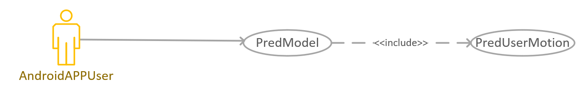

  | **Brief Introduction**                                       | **Actors**           | **Pre-Conditions**                          |
  | ------------------------------------------------------------ | -------------------- | ------------------------------------------- |
  | Use trained model and real-time monitoring **#MotionData#**, to give real-time **#MotionPrediction#** and **#AndroidApp#** shows the result, until **#AndroidAppUser#** stops. | **#AndroidAppUser#** | **#AndroidApp#** has changed to Model mode. |

  | Basic Flow | Actor                                   | System                  |
  | ---- | --------------------------------------- | ----------------------- |
  | 1    | **#AndroidAppUser#** click "PredUserMotion" button |                         |
  | 2    |                                         | **#AndroidApp#** shows the **#MotionPrediction#** |
  | 3    | **#AndroidAppUser#** click "end" button                 |                         |
  | 4    |                                         | **#AndroidApp#** releases connection |

  | **Exception Flow** | Actor | System                                                       |
  | ------------------ | ----- | ------------------------------------------------------------ |
  | 2.2                |       | If **#AndroidApp#** receives error information, **#AndroidApp#** shows the error notion, and back to Equip mode |
  | 2.3                |       | If **#AndroidApp#** waits more than time limitation, **#AndroidApp#** shows the error notion, and back to Equip mode |

  > **Post Condition**: **#AndroidApp#** shows the **#MotionPrediction#**

- **(2) Case: Collectdata**

  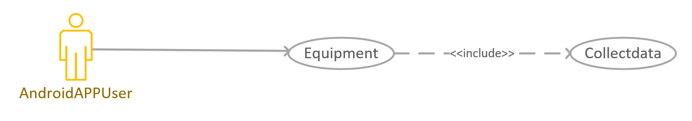

  | **Brief Introduction**                                       | **Actors**           | **Pre-Conditions**                            |
  | ------------------------------------------------------------ | -------------------- | --------------------------------------------- |
  | **#AndroidApp#** requests to begin and end getting **#MotionData#**, and **#System#** saves the **#MotionData#** as **[MotionRecord]**. | **#AndroidAppUser#** | **#AndroidApp#** has changed into Equip mode. |

  | **Basic Flow** | Actor                                            | System                                                       |
  | -------------- | ------------------------------------------------ | ------------------------------------------------------------ |
  | 1              | **#AndroidAppUser#** click "Collect Data" button |                                                              |
  | 2              |                                                  | **#AndroidApp#** shows the **[MotionTag]**, and wait **#AndroidAppUser#** to choose |
  | 3              | **#AndroidAppUser#** choose one **[MotionTag]**  |                                                              |
  | 4              | **#AndroidAppUser#** click "Finish Data" button  |                                                              |
  | 5              |                                                  | **#AndroidApp#** shows successful notion                     |
  
  | **Exception Flow** | Actor | System                                                       |
  | ------------------ | ----- | ------------------------------------------------------------ |
  | 5.2                |       | If **#AndroidApp#** receives error information, **#AndroidApp#** shows error notion and back to Equip mode |

  > **Post Condition**: **#MotionData#** has been collected and saved.

#### 2.1.3 The secondary use cases

- **(3) Case: Login**

  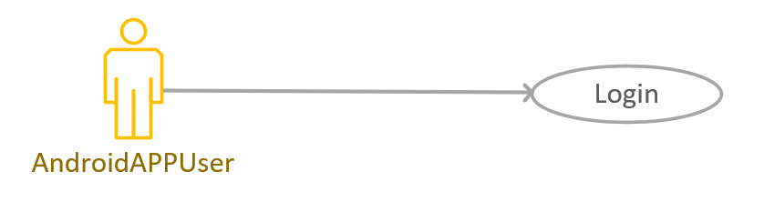

  | **Brief Introduction**                                       | **Actors**              | **Pre-Conditions**               |
  | ------------------------------------------------------------ | ----------------------- | -------------------------------- |
  | Allow **#AndroidAppVisitor#** to log in the **#AndroidApp#**. | **#AndroidAppVisitor#** | The **#AndroidApp#** is running. |

  | Basic Flow | Actor                                     | System                   |
  | ---------- | ----------------------------------------- | ------------------------ |
  | 1          | **#AndroidAppVisitor#** input **[AccountNumberAndPassword]** |                          |
  | 2          |                                           | Show a successful notion |
  | 3          |                                           | Become **#AndroidAppUser#**      |
  
  | Exception Flow | Actor | System                                                       |
  | -------------- | ----- | ------------------------------------------------------------ |
  |                |       | From basic flow 1                                            |
  | 4              |       | Inform **#AndroidAppVisitor#** that he or she has input a **[AccountNumber]** that not exists or a wrong **[Password]**. |
  
  > **Post Conditions**: **#AndroidAppUser#**'s **[AccountNumberAndPassword]** is stored.
  
- **(4) Case: Register**

  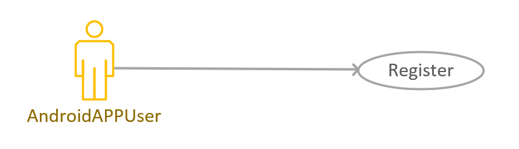
  
  | **Brief Introduction**                     | **Actors**              | **Pre-Conditions**                                     |
  | ------------------------------------------ | ----------------------- | ------------------------------------------------------ |
  | **#AndroidAppVisitor#** wants to register. | **#AndroidAppVisitor#** | **#AndroidAppVisitor#** has launched **#AndroidApp#**. |
  
  | Basic Flow | Actor                           | System                                                 |
  | ---------- | ------------------------------- | ------------------------------------------------------ |
  | 1          | **#AndroidAppVisitor#** inputs **[AccountNumber]** |                                                        |
  | 2          |                                 | **#AndroidApp#** checks whether **[AccountNumber]** is legal |
  | 3          | **#AndroidAppVisitor#** inputs **[Password]** |                                                        |
  | 4          |                                 | **#AndroidApp#** checks whether **[Password]** is legal     |
  | 5          | **#AndroidAppVisitor#** reinputs **[Password]** |                                                        |
  | 6          |                                 | **#AndroidApp#** checks whether the two **[Password]**s are same |
  | 7          | **#AndroidAppVisitor#** inputs **[RegisterInformation]** except **[AccountNumberAndPassword]** |                                                        |
  | 8          |                                 | **#AndroidApp#** checks whether the **[RegisterInformation]** except **[AccountNumberAndPassword]** is legal |
  | 9         |                                 | **#AndroidApp#** shows successful notion and **[AccountNumber]** |
  
  | Exception Flow | Actor | System                                                       |
  | -------------- | ----- | ------------------------------------------------------------ |
  | 2.2            |       | If **[AccountNumber]** is not legal, shows mistake notion and back to step 1 |
  | 4.2            |       | If **[Password]** is not legal, shows mistake notion and back to step 3 |
  | 6.2            |       | If **[Password]** is different, shows mistake notion and back to step 5 |
  | 8.2            |       | If **[RegisterInformation]** except **[AccountNumberAndPassword]** is not legal, shows mistake notion and back to step 7 |
  | 9.2            |       | If **#AndroidApp#** receives error information, **#AndroidApp#** shows the error notion. |
  | 9.3            |       | If **#AndroidApp#** waits more than time limitation, **#AndroidApp#** shows the error notion. |
  
  > **Post Conditions**: **#AndroidAppVisitor#**  registers as **#AndroidAppUser#** .
  
- **(5) Case: LogOut**  

  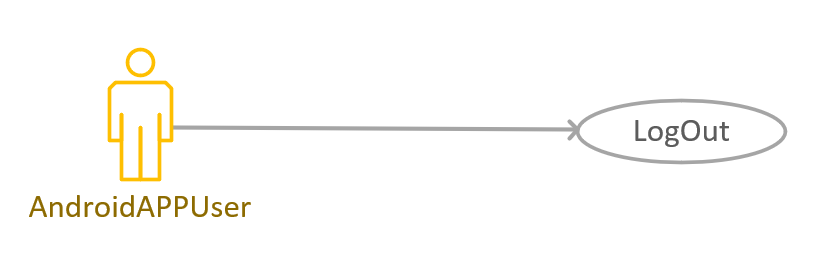

  | **Brief Introduction**                  | **Actors**           | **Pre-Conditions**                                       |
  | --------------------------------------- | -------------------- | -------------------------------------------------------- |
  | **#AndroidAppUser#** wants to logs out. | **#AndroidAppUser#** | **#AndroidAppUser#** has logged in the **#AndroidApp#**. |

  | **Basic Flow** | Actor                                           | System                                    |
  | -------------- | ----------------------------------------------- | ----------------------------------------- |
  | 1              | **#AndroidAppUser#** click the “log out” button |                                           |
  | 2              |                                                 | The **#AndroidApp#** turn to visitor mode |
  
- **(6) Case: UserInfo**  

  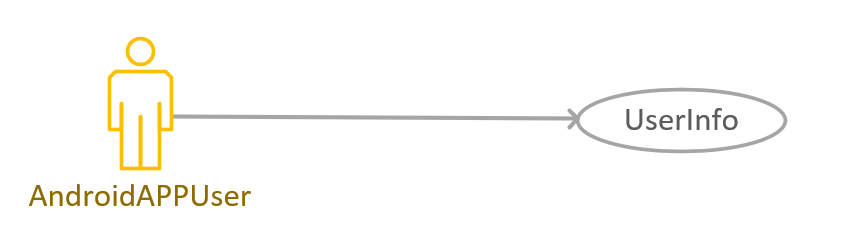

  | **Brief Introduction**                                       | **Actors**           | **Pre-Conditions**                                       |
  | ------------------------------------------------------------ | -------------------- | -------------------------------------------------------- |
  | **#AndroidAppUser#** choose to do something with personal **[AccountInformation]**. | **#AndroidAppUser#** | **#AndroidAppUser#** has logged in the **#AndroidApp#**. |

  | **Basic Flow** | Actor                                                     | System                             |
  | -------------- | --------------------------------------------------------- | ---------------------------------- |
  | 1              | **#AndroidAppUser#** click the “User Information” button. |                                    |
  | 2              |                                                           | Jump to User Information interface |
  
- **(7) Case: GetPersonInfo**  

  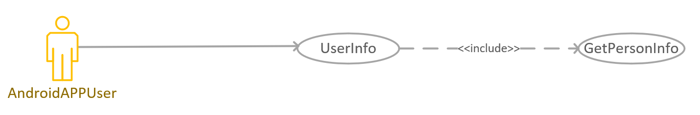

  | **Brief Introduction**                                       | **Actors**           | **Pre-Conditions**                                         |
  | ------------------------------------------------------------ | -------------------- | ---------------------------------------------------------- |
  | **#AndroidAppUser#** wants to get the personal **[AccountInformation]** set before. | **#AndroidAppUser#** | **#AndroidAppUser#** choose the “user information” button. |

  | **Basic Flow** | Actor                                                        | System                                          |
  | -------------- | ------------------------------------------------------------ | ----------------------------------------------- |
  | 1              | **#AndroidAppUser#** choose to get **[AccountInformation]**. |                                                 |
  | 3              |                                                              | Display **[AccountInformation]** on the screen. |
  
- **(8) Case: SetPersonInfo**  

  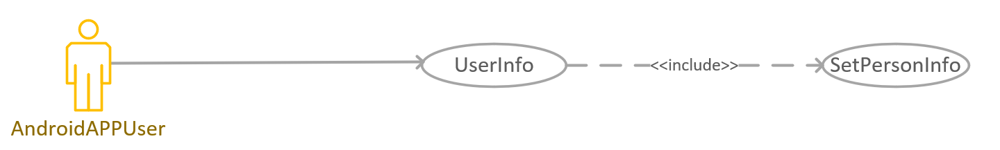

  | **Brief Introduction**                                       | **Actors**           | **Pre-Conditions**                                         |
  | ------------------------------------------------------------ | -------------------- | ---------------------------------------------------------- |
  | **#AndroidAppUser#** wants to modify personal **[AccountInformation]**. | **#AndroidAppUser#** | **#AndroidAppUser#** choose the “user information” button. |

  | **Basic Flow** | Actor                                                        | System                               |
  | -------------- | ------------------------------------------------------------ | ------------------------------------ |
  | 1              | **#AndroidAppUser#** choose to set **[AccountInformation]**. |                                      |
  | 2              | **#AndroidAppUser#** input **[AccountInformation]** except **[AccountNumber]** |                                      |
  | 3              |                                                              | Display successful notion on screen. |

  | Exception Flow | Actor | System                                                       |
  | -------------- | ----- | ------------------------------------------------------------ |
  | 1              |       | The Exception Flow begins after step 3 of the main flow      |
  | 2              |       | The **#AndroidApp#** informed the **#AndroidAppUser#** that he or she has input invalid **[AccountInformation]**. |
  
  > **Post Conditions**: **[AccountInformation]** has been modified.
  
- **(9) Case: Equipment**  

  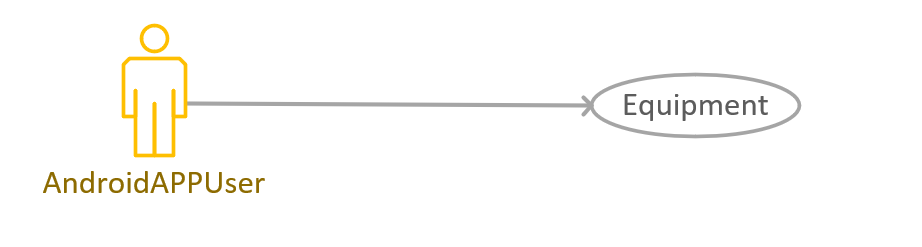

  | **Brief Introduction**                                       | **Actors**           | **Pre-Conditions**                  |
  | ------------------------------------------------------------ | -------------------- | ----------------------------------- |
  | The **#AndroidAppUser#** chooses to bind the **#Device#** with **#AndroidApp#**. | **#AndroidAppUser#** | **#AndroidAppUser#** has logged in. |

  | **Basic Flow** | Actor                                            | System                       |
  | -------------- | ------------------------------------------------ | ---------------------------- |
  | 1              | **#AndroidAppUser#** click the equipment button. |                              |
  | 2              |                                                  | Jump to equipment interface. |
  
- **(10) Case: ConnectEquip**  

  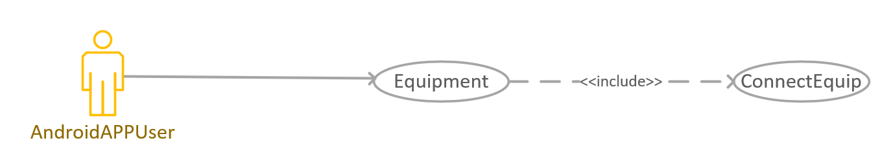

  | **Brief Introduction**                                       | **Actors**           | **Pre-Conditions**                                |
  | ------------------------------------------------------------ | -------------------- | ------------------------------------------------- |
  | **#AndroidAppUser#** input the **[IPAddress]** and **[Port]** of the **#Device#**, and the **#System#** saves this. | **#AndroidAppUser#** | **#AndroidApp#** has changed into Equipment mode. |

  | **Basic Flow** | Actor                                                      | System                                                       |
  | -------------- | ---------------------------------------------------------- | ------------------------------------------------------------ |
  | 1              | **#AndroidAppUser#** Click "ConnectEquip" button           |                                                              |
  | 2              |                                                            | **#AndroidApp#** shows the textbox, and wait **#AndroidAppUser#** to input **[IPAddress]** and **[Port]** |
  | 3              | **#AndroidAppUser#** inputs **[IPAddress]** and **[Port]** |                                                              |
  | 4              |                                                            | **#AndroidApp#** checks whether the input contents are legal and shows successful notion |
  
  | **Exception Flow** | Actor | System                                                       |
  | ------------------ | ----- | ------------------------------------------------------------ |
  | 4.2                |       | If the **[IPAddress]** or the **[Port]** is illegal, **#AndroidApp#** shows the mistake notion, and back to step 3 |
  | 4.3                |       | If **#AndroidApp#** receives error information(For example, the user has connected to one **#Device#**), **#AndroidApp#** shows the error notion, and back to Equip mode |
  | 4.4                |       | If **#AndroidApp#** waits more than time limitation, **#AndroidApp#** shows the error notion, and back to Equip mode |
  
  > **Post Conditions**: **[DeviceIdentifier]** is saved.
- **(11) Case: GetEquipInfo**  

  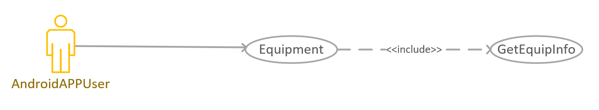

  | **Brief Introduction**                                       | **Actors**           | **Pre-Conditions**                            |
  | ------------------------------------------------------------ | -------------------- | --------------------------------------------- |
  | **#AndroidAppUser#** requests to give the **[DeviceInformation]**. | **#AndroidAppUser#** | **#AndroidApp#** has changed into Equip mode. |

  | Basic Flow | Actor                                            | System                                         |
  | ---------- | ------------------------------------------------ | ---------------------------------------------- |
  | 1          | **#AndroidAppUser#** Click "GetEquipInfo" button |                                                |
  | 2          |                                                  | **#AndroidApp#** shows **[DeviceInformation]** |
  
  | **Exception Flow** | Actor | System                                                       |
  | ------------------ | ----- | ------------------------------------------------------------ |
  | 6.2                |       | If **#AndroidApp#** receives mistake information(For example, Server cannot connect the **#Device#**), **#AndroidApp#** shows the mistake information and back to Equip mode |
  | 6.3                |       | If **#AndroidApp#** receives error information, **#AndroidApp#** shows the error notion, and back to Equip mode |
  | 6.4                |       | If **#AndroidApp#** waits more than time limitation, **#AndroidApp#** shows the error notion, and back to Equip mode |
  
- **(12) Case: UnbindEquip**  

  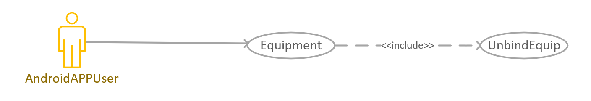

  | **Brief Introduction**                             | **Actors**           | **Pre-Conditions**                            |
  | -------------------------------------------------- | -------------------- | --------------------------------------------- |
  | **#AndroidAppUser#** wants to unbind **#Device#**. | **#AndroidAppUser#** | **#AndroidApp#** has changed into Equip mode. |

  | **Basic Flow** | Actor                                                   | System                                      |
  | -------------- | ------------------------------------------------------- | ------------------------------------------- |
  | 1              | **#AndroidAppUser#** clicks "UnbindEquip" button        |                                             |
  | 2              |                                                         | **#AndroidApp#** shows the **[SensorList]** |
  | 3              | **#AndroidAppUser#** chooses the **#Device#** to unbind |                                             |
  | 4              |                                                         | **#AndroidApp#** shows successful notion    |
  
  | Exception Flow | Actor | System                                                       |
  | -------------- | ----- | ------------------------------------------------------------ |
  | 2.2            |       | If there is no **#Device#**s on the **#AndroidAppUser#**, show mistake notion and back to Equip mode |
  | 4.2            |       | If **#AndroidApp#** receives error information, **#AndroidApp#** shows the error notion, and back to Equip mode |
  | 4.3            |       | If **#AndroidApp#** waits more than time limitation, **#AndroidApp#** shows the error notion, and back to Equip mode |
  
  > **Post Condition**:  A **#Device#** of **#AndroidAppUser#** is successfully unbinded
- **(13) Case: GetEquipStatus** 

  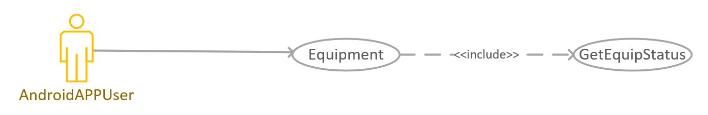

  | **Brief Introduction**                                       | **Actors**           | **Pre-Conditions**                            |
  | ------------------------------------------------------------ | -------------------- | --------------------------------------------- |
  | **#AndroidAppUser#** requests to obtain the **[DeviceStatus]** of a **#Device#**. | **#AndroidAppUser#** | **#AndroidApp#** has changed into Equip mode. |

  | **Basic Flow** | Actor                                            | System                                    |
  | -------------- | ------------------------------------------------ | ----------------------------------------- |
  | 1              | **#AndroidAppUser#** Click "GetEquipInfo" button |                                           |
  | 2              |                                                  | **#AndroidApp#** shows **[DeviceStatus]** |
  
  | **Exception Flow** | Actor | System                                                       |
  | ------------------ | ----- | ------------------------------------------------------------ |
  | 2.2                |       | If **#AndroidApp#** receives mistake information(For example, Server cannot connect the **#Device#**), **#AndroidApp#** shows the mistake information and back to Equip mode |
  | 2.3                |       | If **#AndroidApp#** receives error information, **#AndroidApp#** shows the error notion, and back to Equip mode |
  | 2.4                |       | If **#AndroidApp#** waits more than time limitation, **#AndroidApp#** shows the error notion, and back to Equip mode |
  
  > **Post Condition**: **#AndroidApp#** gets the **[DeviceStatus]**
- **(14) Case: GetUserGuide**

  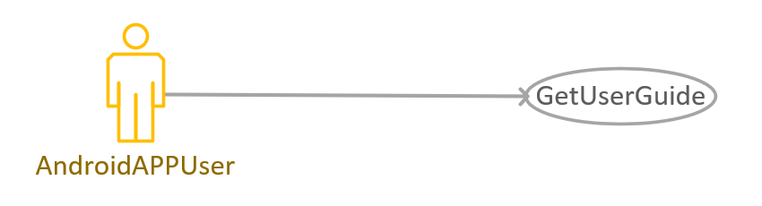

  | **Brief Introduction**                                      | **Actors**           | **Pre-Conditions**                  |
  | ----------------------------------------------------------- | -------------------- | ----------------------------------- |
  | **#AndroidAppUser#** gets the **#AndroidApp#**'s user guide | **#AndroidAppUser#** | **#AndroidAppUser#** has logged in. |

  | **Basic Flow** | Actor                                             | System                               |
  | -------------- | ------------------------------------------------- | ------------------------------------ |
  | 1              | The **#AndroidAppUser#** choose to get user guide |                                      |
  | 2              |                                                   | Get user guide and show it on screen |
  
- **(15) Case: PredModel**  

  | **Brief Introduction**                               | **Actors**           | **Pre-Conditions**                  |
  | ---------------------------------------------------- | -------------------- | ----------------------------------- |
  | Change into model mode to get **#MotionPrediction#** | **#AndroidAppUser#** | **#AndroidAppUser#** has logged in. |

  | **Basic Flow** | Actor             | System                      |
  | ---- | ----------------- | --------------------------- |
  | 1    | **#AndroidAppUser#** clicks Model |                             |
  | 2    |                   | **#AndroidApp#** changes into model mode |
  
  > **Post Condition**: **#AndroidApp#** changes into model mode
  
- **(16) Case: ResetModel**   

  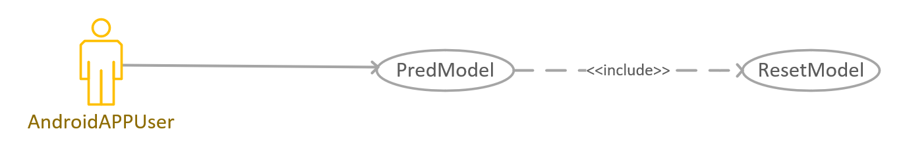

  | **Brief Introduction**                                       | **Actors**           | **Pre-Conditions**                             |
  | ------------------------------------------------------------ | -------------------- | ---------------------------------------------- |
  | **#AndroidAppUser#** requests to change the model to initial model, whether the model is initial model or not. | **#AndroidAppUser#** | **#AndroidApp#** has changed into Model model. |

  | **Basic Flow** | Actor                                           | System                                   |
  | -------------- | ----------------------------------------------- | ---------------------------------------- |
  | 1              | **#AndroidAppUser#** clicks "ResetModel" button |                                          |
  | 2              |                                                 | **#AndroidApp#** shows successful notion |
  
  | Exception Flow | Actor | System                                                       |
  | -------------- | ----- | ------------------------------------------------------------ |
  | 2.2            |       | If **#AndroidApp#** receives error information, **#AndroidApp#** shows the error notion, and back to Equip mode |
  | 2.3            |       | If **#AndroidApp#** waits more than time limitation, **#AndroidApp#** shows the error notion, and back to Equip mode |
  
  > **Post Condition**: The model is resetted.
  
- **(17) Case: ShowModelInfo**  

  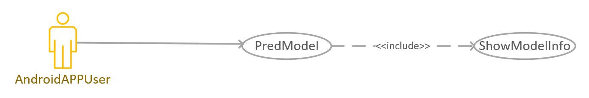

  | **Brief Introduction**                                    | **Actors**           | **Pre-Conditions**                             |
  | --------------------------------------------------------- | -------------------- | ---------------------------------------------- |
  | **#AndroidAppUser#** requests to get the **[ModelInfo]**. | **#AndroidAppUser#** | **#AndroidApp#** has changed into Model model. |

  | Basic Flow | Actor                             | System                        |
  | ---------- | --------------------------------- | ----------------------------- |
  | 1          | **#AndroidAppUser#** click "ShowModelInfo" button |                               |
  | 2          |                                   | **#AndroidApp#** shows the **[ModelInfo]** |
  
  | Exception Flow | Actor | System                                                       |
  | ---------------- | ----- | ------------------------------------------------------------ |
  | 2.2              |       | If **#AndroidApp#** has not connected to Internet, **#AndroidApp#** shows mistake information and back to Equip mode |
  | 2.3              |       | If **#AndroidApp#** receives error information, **#AndroidApp#** shows the error notion, and back to Equip mode |
  | 2.4              |       | If **#AndroidApp#** waits more than time limitation, **#AndroidApp#** shows the error notion, and back to Equip mode |

- **(18) Case: DataManagement**

  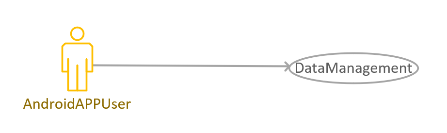

  | **Brief Introduction**                                       | **Actors**           | **Pre-Conditions**                  |
  | ------------------------------------------------------------ | -------------------- | ----------------------------------- |
  | **#AndroidAppUser#** changes into data mode to manage the collected **[MotionRecord]**s. | **#AndroidAppUser#** | **#AndroidAppUser#** has logged in. |

  | Basic Flow | Actor                       | System                     |
  | ---------- | --------------------------- | -------------------------- |
  | 1          | **#AndroidAppUser#** clicks Data management |                            |
  | 2          |                             | **#AndroidApp#** changes into data mode |
  
> **Post Conditions**: **#AndroidApp#** changes into data mode.

- **(19) Case: GetData**  

  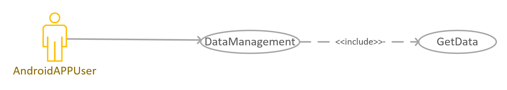

  | **Brief Introduction**                           | **Actors**           | **Pre-Conditions**                           |
  | ------------------------------------------------ | -------------------- | -------------------------------------------- |
  | **#AndroidApp#** requests to get **#DataList#**. | **#AndroidAppUser#** | **#AndroidApp#** has changed into data mode. |

  | Basic Flow | Actor                | System                       |
  | ---------- | -------------------- | ---------------------------- |
  | 1          | **#AndroidAppUser#** clicks 'get data' |                              |
  | 2          |                      | **#AndroidApp#** shows **#DataList#** of **[MotionRecord]**s |
  
  | Exception Flow | Actor | System                                                       |
  | -------------- | ----- | ------------------------------------------------------------ |
  | 2.2            |       | If **#AndroidApp#** cannot connect to Internet, shows mistake notion and back to data mode |
  

- **(20) Case: DiscardData** 

  

  | **Brief Introduction**                                       | **Actors**           | **Pre-Conditions**                           |
  | ------------------------------------------------------------ | -------------------- | -------------------------------------------- |
  | **#AndroidAppUser#** requests to get **#DataList#**, and delete chosen **[MotionRecord]**. | **#AndroidAppUser#** | **#AndroidApp#** has changed into data mode. |

  | **Basic Flow** | Actor                                                     | System                                                       |
  | -------------- | --------------------------------------------------------- | ------------------------------------------------------------ |
  | 1              | **#AndroidAppUser#** clicks 'get data'                    |                                                              |
  | 2              |                                                           | **#AndroidApp#** shows **#DataList#** of **[MotionRecord]**s |
  | 3              | **#AndroidAppUser#** chooses **[MotionRecord]** to delete |                                                              |
  | 4              |                                                           | **#AndroidApp#** shows successful notion                     |
  
  | **Exception Flow** | Actor | System                                                       |
  | ---------------- | ----- | ------------------------------------------------------------ |
  | 1.2              |       | If **#AndroidApp#** cannot connect to Internet, shows mistake notion and back to data mode |
  | 2.2              |       | If nothing on **#DataList#**, **#AndroidApp#** shows mistake notion and back to data mode |
  | 3.2              |       | If **#AndroidAppUser#** chooses nothing or quit, **#AndroidApp#** shows delete nothing and back to data mode |
  | 4.2              |       | If **#AndroidApp#** cannot connect to Internet, shows mistake notion and back to data mode |
  
  > **Post Conditions**: Discard chosen **[MotionRecord]**, and **#AndroidApp#** back into data mode.

- **(21) Case: ChangeDataLabel**

  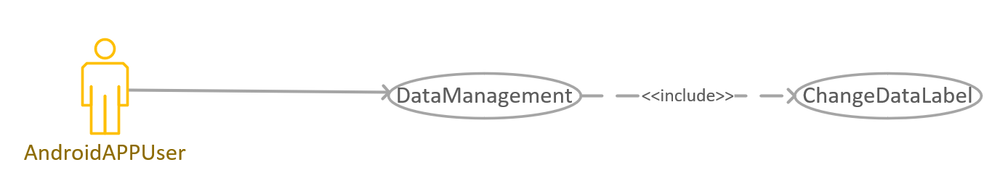

  | **Brief Introduction**                                       | **Actors**           | **Pre-Conditions**                           |
  | ------------------------------------------------------------ | -------------------- | -------------------------------------------- |
  | **#AndroidAppUser#** wants to change the **[MotionTag]** of **[MotionRecord]**. | **#AndroidAppUser#** | **#AndroidApp#** has changed into data mode. |

  | **Basic Flow** | Actor                                                        | System                                                       |
  | -------------- | ------------------------------------------------------------ | ------------------------------------------------------------ |
  | 1              | **#AndroidAppUser#** clicks 'change label'                   |                                                              |
  | 2              |                                                              | **#AndroidApp#** shows **[MotionTag]** of **[MotionRecord]** |
  | 3              | **#AndroidAppUser#** chooses **[MotionTag]** to change, and chooses the new **[MotionTag]** |                                                              |
  | 4              |                                                              | **#AndroidApp#** shows successful notion                     |
  
  | **Exception Flow** | Actor | System                                                       |
  | ------------------ | ----- | ------------------------------------------------------------ |
  | 1.2                |       | If **#AndroidApp#** cannot connect to Internet, shows mistake notion and back to data mode |
  | 2.2                |       | If nothing on **#DataList#**, **#AndroidApp#** shows mistake notion and back to data mode |
  | 3.2                |       | If **#AndroidAppUser#** chooses nothing, or the new **[MotionTag]** is the same as the old one, or quit, **#AndroidApp#** shows alter nothing and back to data mode |
  | 4.2                |       | If **#AndroidApp#** cannot connect to Internet, shows mistake notion and back to data mode |
  
  > **Post Conditions**: **#AndroidApp#** upload **[MotionRecord]**, and back into data mode.

### 2.2 User Stories for the User of **#WebApp#**

#### 2.2.1 Use Case Diagram for **#SystemAdministrator#**

#### 2.2.2 Main user stories and corresponding main use cases

The main purpose of the user of **#WebApp#** is listed as follows:

|User Story|Main Use Cases|
|-|-|
|As an **#SystemAdministrator#** of the **#Software#**, I want to view, modify the binding relationship between **#AndroidApp#** users and **#Device#**s.|(1) Case: **#SystemAdministrator#** wants to view the list of **#Device#**s|
|As an **#SystemAdministrator#** of the **#Software#**, I want to manage **#AndroidAppUser#**'s **[RegisterInformation]**.|(2) Case: **#SystemAdministrator#** wants to manage **[RegisterInformation]**|

The detailed description of the main use cases.

- **(1) Case: #SystemAdministrator# wants to view the list of #Device#s**

  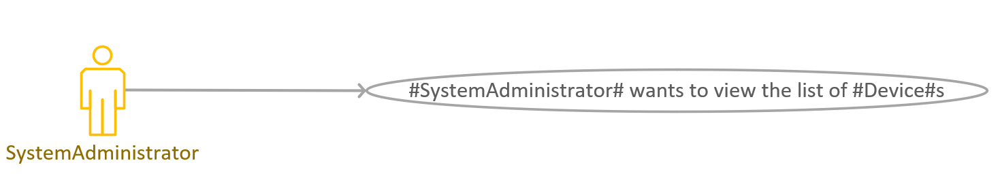
  
  | **Brief Introduction**                                       | **Actors**                | **Pre-Conditions**                    |
  | ------------------------------------------------------------ | ------------------------- | ------------------------------------- |
  | The **#SystemAdministrator#** is able to access list of the **#Device#**s which are connecting with the **#System#**. | **#SystemAdministrator#** | The **#WebApp#** is open and running. |
  
  | Basic Flow | Actor                                                        | System                                       |
  | ---------- | ------------------------------------------------------------ | -------------------------------------------- |
  | 1          | The **#SystemAdministrator#** hovers his mouse over the **#Device#**s key. |                                              |
  | 2          |                                                              | **#WebApp#** shows list of the **#Device#**s |
  
  > **Post Conditions**: **#SystemAdministrator#** obtains the list of **#Device#**s.
  
- **(2) Case: #SystemAdministrator# wants to manage [RegisterInformation]**

  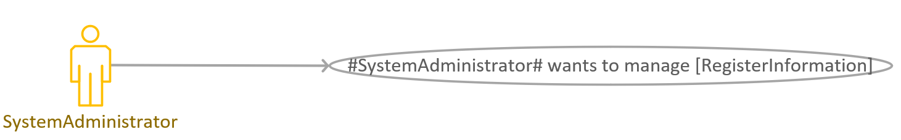
  
  | **Brief Introduction**                                       | **Actors**                | **Pre-Conditions**                    |
  | ------------------------------------------------------------ | ------------------------- | ------------------------------------- |
  | The **#SystemAdministrator#** is able to manage **[RegisterInformation]** of the **#AndroidAppUser#**s. | **#SystemAdministrator#** | The **#WebApp#** is open and running. |
  
  | **Basic Flow** | Actor                                                        | System                                                       |
  | -------------- | ------------------------------------------------------------ | ------------------------------------------------------------ |
  | 1              | The **#SystemAdministrator#** hovers his mouse over the users management key. |                                                              |
  | 2              |                                                              | Web page shows **[RegisterInformation]** and the add, delete, revise, import and derive keys. |
  | 3              | **#SystemAdministrator#** views **[RegisterInformation]** and manage **[RegisterInformation]**. |                                                              |
  
  > **Post Conditions**: **#SystemAdministrator#** can manage the  **#AndroidAppUser#**'s **[RegisterInformation]**.

#### 2.2.3 The secondary use cases

- **(3) Case: #SystemAdministrator# wants to view the historical [MotionRecord]**

  
  
  | **Brief Introduction**                                       | **Actors**                | **Pre-Conditions**                    |
  | ------------------------------------------------------------ | ------------------------- | ------------------------------------- |
  | The **#SystemAdministrator#** is able to access historical **[MotionRecord]**. | **#SystemAdministrator#** | The **#WebApp#** is open and running. |
  
  | **Basic Flow** | Actor                                                        | System                                                       |
  | -------------- | ------------------------------------------------------------ | ------------------------------------------------------------ |
  | 1              | The **#SystemAdministrator#** hovers his mouse over the history key. |                                                              |
  | 2              |                                                              | **#WebApp#** shows the **[MotionRecord]**.                   |
  | 3              | **#SystemAdministrator#** views the **[MotionRecord]**.      |                                                              |
  | 4              | **#SystemAdministrator#** chooses to delete the history **[MotionRecord]**. |                                                              |
  | 5              |                                                              | If the **#SystemAdministrator#** is successfully deleted, the page is returned. If the **#SystemAdministrator#** fails to delete, **#System#** prompt for deletion failed. |
  
  > **Post Conditions**: **#SystemAdministrator#** can view the historical **[MotionRecord]** and delete them.

## 3.Appendix

### 3.1 Explanation of Terms
| Term                       | Explanation                                                  |
| -------------------------- | ------------------------------------------------------------ |
| **#AndroidApp#**           | An android application for **#Customer#**.           |
| **#AndroidAppTeam#**       | A synonym for "**Dreamweaver-GUI Team**".                    |
| **#CentralServer#**        | The program created by "**genshin-impact-server team**", which is a **#ServerProgram#**. |
| **#DataList#** | List of **[MotionRecord]**s of  **#AndroidAppUser#**. |
| **#Device#**               | A raspberry pi with six sensors, each **#Device#** will have a **FIXED** **[IPAddress]** and **[Port]** so that it can be accessed from the Internet if the **#Device#** is powered on. |
| **#ManageTheWholeSystem#** | View, modify the binding relationship between users and **#Device#**s, manage user information and issue notifications. |
| **#MotionData#** | Data recorded by users through the **#AndroidApp#** |
| **#MotionPrediction#** | The real-time predictions displayed by **#AndroidApp#** using the trained model according to the current **#MotionData#**. |
| **#RA#**                   | Short for "**Requirement Analysis**", which is a synonym for "**Software Requirement Specification**". |
| **#ServerProgram#**        | A program which will keep running 24hours a day.             |
| **#Software#**             | Refer to the software system 'Motion Prediction (MoPre)'.    |
| **#System#**               | Same as **#Software#**                                       |
|**#SystemAdministrator#**|User of **#WebApp#**, the administrator will use the **#WebApp#** as a dashboard to check and **#ManageTheWholeSystem#**.|
|**#AndroidAppUser#**|User of **#AndroidApp#**, who has logged in.|
|**#AndroidAppVisitor#**|User of **#AndroidApp#**, who has not logged in.|
| **#WebApp#**               | A web site for the **#SystemAdministrator#**.                     |
| **#WebTeam#**              | A synonym for "**mvps Team**".                               |

### 3.2 Data Definition

| Data                | Definition                                                         |
| ------------------------------ | ------------------------------------------------------------ |
| **[AccountInformation]**       | = AccountNumber + (PhoneNumber) + (EmailAddress) + (Birthday) |
| **[AccountNumber]**           | A non-empty string consists of digits `"0-9"`, Latin letters `"a-z, A-Z"` and underscore `"_"`. |
| **[AccountNumberAndPassword]** | = AccountNumber + Password                                   |
| **[DeviceIdentifier]**         | = IPAddress+ Port                  |
| **[DeviceInformation]**        | = DeviceIdentifier + {SensorInformation}6                    |
| **[DeviceStatus]**             | = {SensorStatus}6                                            |
| **[InitialTimestamp]**        | A Timestamp, used to mark the beginning time of a motion record. |
| **[IPAddress]**               | A string consists of digits and dot `"."`.                   |
| **[ModelInfo]**                | = modelflag + acc                                            |
| **[MotionFrame]**              | = {X + Y + Z + asX + asY + asZ + accX + accY + accZ}9 + Timestamp.  `X, Y, Z, asX, asY, asZ, accX, accY, accZ` are nine real numbers provided by the embedded system. |
| **[MotionRecord]**             | = AccountNumber + InitialTimestamp + MotionTag + {MotionFrame} |
| **[MotionTag]**               | An integer between 0 and 6, including 0 and 6. `0` represents `'Sit'`, `1` represents `'Stand'`, `2` represents `'Go straight'`, `3` represents `'Go uphill/upstairs'`, `4` represents `'Go downhill/dwonstairs'`, `5` represents `'Go left'`, and `6` represents `'Go right'`.     |
| **[Password]**                | A non-empty string. The **#AndroidApp#** SHOULD assure that the password is "legal" so that the other team will just regard it as a string. |
| **[Port]**                    | An integer not less than zero.                               |
| **[RegisterInformation]**      | = AccountNumber + Password + (PhoneNumber) + (EmailAddress) + (Birthday) |
| **[SensorBattery]**           | A non-negative integer which is not greater than 100.        |
| **[SensorInformation]**        | = MACAddress + Name                                          |
| **[SensorList]**               | = {SensorInformation}6                                       |
| **[SensorOnlineStatus]**      | An integer, where `0` represents the sensor is offline, and `1` represents the sensor is online. |
| **[SensorStatus]**             | = SensorOnlineStatus + SensorBattery                         |
| **[Timestamp]**                | An integer, representing milliseconds from `1970-01-01 00:00`. |