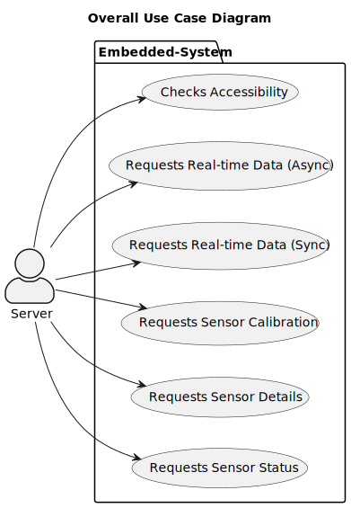

# Software Requirements Specification (SRS)

Version 1, last updated by Aidan at 2023-3-23

[TOC]

## 1. Introduction

### 1.1 Intended Audience and Purpose

This document is intended to provided information guiding the development process, ensuring that all system requirements are met. The following entities may find the document useful:

Primary Customer - This page will detail all of the application requirements as understood by the production team. The customer should be able to determine that their requirements will be correctly reflected in the final product through the information found on this page.

User - A prospective user will be able to use this document to identify the main functionailty included in the application. Furthermore, the application will have a set of system requirements before the application can be run. Details regarding these requirements can be found here.

Development Team - Details of specific requirements that the final software build must include will be located here. Developers can use this document to ensure the software addresses each of these requirements.

QA Team - By developing testing procedures founded in the system requirements, the QA Team can create a comprehensive testing regimen that will guarantee requirements are met.

## 2. Use Cases

### 2.1 Case 1: Server Requests Real-time Data (Async)

| Author     | Version | Statue    | Date       |
| ---------- | ------- | --------- | ---------- |
| Aidan, Bob | 1       | Unaudited | 2023-03-21 |

**Brief Introduction**

When the server requests the data that the sensor starts detecting, the process starts; When the server requests to stop transmitting data, the process ends.

**Actors**

- Server

**Pre-Conditions**

- The embedded system has been powered on.

- The network is available and the server is able to send messages to the embedded system.
- The embedded system is not in **real-time data transmission mode**.

**Basic Flow**

1. The server **REQUESTs** to obtain real-time data, with the sampling rate attached.
2. The embedded system gets the **REQUEST** and send the **RESPONSE** that it is ready to deliver real-time data.
3. The embedded system enters **real-time data transmission mode**.
4. The embedded system gets real-time data and **SEND(by REQUEST)** it back to server.
5. the server get the real-time data and **RESPONSE** to the embedded system that the data is collected.
6. Repeat steps 3 and 4 for several times until the server no longer wants to continue receiving data.
7. The server **REQUESTs** to stop sending real-time data.
8. The embedded system stop the detection of real-time data, the embedded system exits **real-time data transmission mode**.
9. The embedded system **RESPONSE** to server that the transmission has been stopped.
10. The server receives the information.

**Exception Flows**

- 10a：If the server can not receives the **RESPONSE** from the embedded system.
  1. The server resend the **REQUEST** as in Basic Flow step 7 for at most three times, if the server gets the **RESPONSE** from the embedded system, use case ends normally. There should be a 0.5-second interval between two **REQUESTs**.
  2. After three unsuccessful attempts, the server determines that the embedded system is unreachable, use case ends with exception.

**Post Conditions**

1. Data received should be cached by the server.
2. The embedded system quits **real-time data transmission mode** after the Basic Flow.

For Exception Flow 10a, The server detected the embedded system offline.

**Supplemental Requirements**

1. Real-time data feedback function is mainly used for recording user data, and the server needs to cache the received data. After the data recording is finished, the user can choose to "upload data" or "discard data". If the user chooses to "upload data", the server will send the data to the database system. Otherwise, the server will delete the cache.
2. Sampling rate is no more than five times per second, due to hardware constraints.
3. Depending on the network environment, the latency of real-time data may vary. Generally, real-time data has a delay of around 200 milliseconds.
4. When the embedded system is in **real-time data transmission mode**, it **CAN** still process other data inquiries (such as the reachability check and sensor details) from the server. However, when the embedded system is in real-time data transmission mode, real-time data transmission requests from the server will be ignored.
5. When the embedded system is in **real-time data transmission mode**, it **CANNOT** make calibration.

**Visual Model**

**Sequence Diagram**

.svg)

**Revision History**

| Version | Date       | Author     | Description      | Status    |
| ------- | ---------- | ---------- | ---------------- | --------- |
| 1       | 2023-03-21 | Aidan, Bob | Original Version | Unaudited |

### 2.2 Case 2: Server Requests Real-time Data (Sync)

| Author     | Version | Statue    | Date       |
| ---------- | ------- | --------- | ---------- |
| Aidan, Bob | 1       | Unaudited | 2023-03-21 |

**Brief Introduction**

When the server requests the data, the process starts; When the server gets the data from the embedded system, the process ends.

**Actors**

- Server

**Pre-Conditions**

- The embedded system has been powered on.

- The network is available and the server is able to send messages to the embedded system.

**Basic Flow**

1. The server **REQUESTs** to obtain real-time data, with the sampling rate attached.
2. The embedded system get the real-time data from the sensors.
3. The embedded system make a **RESPONSE** to the server.
4. The server receives the information.

**Exception Flows**

- 4a: If the server fails to receive the real-time data from the embedded system, the server **WILL NOT** retry to request again, the data it should have received will be regarded as the latest cached data or an INVALID data (if there are no value cached).

**Post Conditions**

1. Data received should be cached by the server.
2. The embedded system quits **real-time data transmission mode** after the Basic Flow.

For Exception Flow 10a, The server detected the embedded system offline.

**Supplemental Requirements**

3. Depending on the network environment, the latency of real-time data may vary. Generally, real-time data has a delay of around 200 milliseconds.
3. Real-time data includes the angles, angular velocities, and accelerations in the XYZ directions, as well as the timestamp of the data sampling determined by the embedded system at the time of sampling.

**Visual Model**

**Sequence Diagram**

.svg)

**Revision History**

| Version | Date       | Author     | Description      | Status    |
| ------- | ---------- | ---------- | ---------------- | --------- |
| 1       | 2023-03-21 | Aidan, Bob | Original Version | Unaudited |

### 2.3 Case 3: Server Checks Whether the Embedded System is Reachable

| Author     | Version | Statue    | Date       |
| ---------- | ------- | --------- | ---------- |
| Aidan, Bob | 1       | Unaudited | 2023-03-21 |

**Brief Introduction**

When the server wants to check if the embedded system is reachable, it sends an HTTP request message to the embedded system, and the process begins. When the server receives a response message from the embedded system, the process ends.

**Actors**

- Server

**Pre-Conditions**

- The embedded system has been powered on.

**Basic Flow**

1. The server sends an  **REQUEST** message to the embedded system to determine whether the embedded system is available.
2. The embedded system receives the request sent by the server.
3. The embedded system send the **RESPONSE** message to the server.
4. The server receives the response message.

**Exception Flows**

- 3a:
  1. When the embedded system send the response, a network error occurs.
  2. The embedded system do nothing, use case ends.

- 4a:
  1. When the server receives the response message, a network error occurs.
  2. The server makes another attempt to send a **REQUEST**, server will retry for at most three times. There should be a 0.5-second interval between two **REQUESTs**. If server get the **RESPONSE** from the embedded system, return to Basic Flow step 4.
  3. After server has been failed to connect for three times, server confirms that the embedded system is unreachable, use case ends.

**Post Conditions**

1. The server confirms that the embedded system is working properly and accessible.

In Exception Flow 4a, server confirms that the embedded system is inaccessible.

**Supplemental Requirements**

1. The Reachability check will be used under many conditions. For example, when a user checks whether an embedded system is connected to the network, the server needs to have a clear understanding of the accessibility of the embedded system, so the server begins a reachability check.
2. During communication, we require that **REQUEST** and **RESPONSE** must correspond one-to-one. Otherwise, it indicates that a network failure has occurred and Exception Flows are triggered. (This constraint applies to all communication issues mentioned later.)

**Visual Model**

**Sequence Diagram**

**Revision History**

| Version | Date       | Author     | Description      | Status    |
| ------- | ---------- | ---------- | ---------------- | --------- |
| 1       | 2023-03-21 | Aidan, Bob | Original Version | Unaudited |

### 2.4 Case 4: Server Requests Sensor Calibration

| Author     | Version | Statue    | Date       |
| ---------- | ------- | --------- | ---------- |
| Aidan, Bob | 1       | Unaudited | 2023-03-21 |

**Brief Introduction**

When the server requests sensor calibration, the process starts; After the server receives the calibration success response or calibration failure response sent by the embedded system, the process ends.

**Actors**

- Server

**Pre-Conditions**

- The embedded system has been powered on.

- The network is available and the server is able to send messages to the embedded system.
- The embedded system is not in **real-time data transmission mode**.

**Basic Flow**

1. The server sends a sensor calibration **REQUEST**;
2. After receiving the request, the embedded system sends a response to the server and performs calibration;
3. After the embedded system calibrates the sensor successfully, it sends a **RESPONSE** to the server.
4. The server receives the information.

**Exception Flows**

- 2a: When **REQUEST** received, if the embedded system is in **real-time data transmission mode**,  the embedded system **RESPONSE** the error message to the server, use case ends.

- 2b: When **REQUEST** received, if the sensors have been calibrated in the recently ten seconds, the embedded system will refuse to calibrate and **RESPONSE** the error message to the server, use case ends.
- 4a: If server failed to receive the information, the server will check the reachability of the embedded system, and Requests Sensor Calibration again if the embedded system is accessible.

**Post Conditions**

1. The server will receive the information of calibration from the embedded system after the Basic Flow.

**Supplemental Requirements**

During calibration, it should be ensured that the sensor is placed on a horizontal stand. The calibration here refers to the acceleration calibration. Since the acceleration of the sensor is measured by the acceleration due to gravity, calibration should be performed before use.

**Visual Model**

**Sequence Diagram**

**Revision History**

| Version | Date       | Author     | Description      | Status    |
| ------- | ---------- | ---------- | ---------------- | --------- |
| 1       | 2023-03-21 | Aidan, Bob | Original Version | Unaudited |

### 2.5 Case 5: Server Requests to Obtain Sensor Details

| Author     | Version | Statue    | Date       |
| ---------- | ------- | --------- | ---------- |
| Aidan, Bob | 1       | Unaudited | 2023-03-21 |

**Brief Introduction**

When the server requests to obtain the sensor details, the process begins, it ends when the server confirms the response has been received. 

**Actors**

- Server

**Pre-Conditions**

- The embedded system has been powered on.

- The network is available and the server is able to send messages to the embedded system.

**Basic Flow**

1. The server **REQUESTs** to obtain the sensor details, including sensor name, sensor type and sensor serial number.

2. The embedded system  **RESPONSE** sensors' details to the server.
3. The server receives the information.

**Exception Flows**

- 3a：
  1. If the server does not receive the **RESPONSE**, it should check the reachability of the embedded system, and try to obtain the sensor details again if the embedded system is reachable (return to Basic Flow step 1).
  2. If the embedded system is not reachable, use case ends.

**Post Conditions**

1. Server can obtain sensor details, including sensor model, sensor serial number.
2. The application returns to the state before request.

**Supplemental Requirements**

1. The details of the sensors are part of the configuration data of the embedded system, even when some sensor runs out of battery, the sensor details **CAN** still be acquired.

2. Sensor details contain sensor name, sensor type and sensor serial number.

**Visual Model**

**Sequence Diagram**

**Revision History**

| Version | Date       | Author     | Description      | Status    |
| ------- | ---------- | ---------- | ---------------- | --------- |
| 1       | 2023-03-21 | Aidan, Bob | Original Version | Unaudited |

### 2.6 Case 6: Server Requests to Obtain the Sensor Status

| Author     | Version | Statue    | Date       |
| ---------- | ------- | --------- | ---------- |
| Aidan, Bob | 1       | Unaudited | 2023-03-21 |

**Brief Introduction**

When the server requests to obtain the sensor status, the process begins; it ends when the server confirms the response has been received.

**Actors**

- Server

**Pre-Conditions**

- The embedded system has been powered on.
- The network is available and the server is able to send messages to the embedded system.

**Basic Flow**

1. The server **REQUESTs** to obtain the current status of the sensor, including sensor connection status, sensor power.
2. The embedded system receives the request and try to connect with the sensors.
3. The sensors reply the embedded system with their status and power.
4. The embedded system collects the data from sensors and makes a **RESPONSE** to the server.
5. The server receives the information.

**Exception Flows**

- 2a：
  1. The embedded system receives the request and sends the request to the sensors.
  2. If the embedded system did not receive the response, the embedded system resend the request to the sensor for at most three times.
  3. If some sensor fails to response for three times, it will be regarded as **OFF**, return to Basic Flow step 4.
- 5a:
  1. If the server can not receives the **RESPONSE** from the embedded system. The server resend the **REQUEST** as in Basic Flow step 1 for at most three times, if the server gets the **RESPONSE** from the embedded system, use case ends normally. There should be a 0.5-second interval between two **REQUESTs**.
  2. After three unsuccessful attempts, the server determines that the embedded system is unreachable, use case ends with exception.

**Post Conditions**

1. Users can obtain sensor status information, including sensor power after the Basic Flow ends.

**Supplemental Requirements**

None.

**Visual Model**

**Sequence Diagram**

**Revision History**

| Version | Date       | Author     | Description      | Status    |
| ------- | ---------- | ---------- | ---------------- | --------- |
| 1       | 2023-03-21 | Aidan, Bob | Original Version | Unaudited |

## 3. Appendices

### 3.1 Definitions and acronyms

#### 3.1.1 Definitions 

| Keyword | Definitions |
| ------- | ----------- |
|         |             |
|         |             |
|         |             |
|         |             |

#### 3.1.2 Acronyms and abbreviations 

| Acronym or Abbreviation | Definitions |
| ----------------------- | ----------- |
|                         |             |
|                         |             |
|                         |             |

### 3.2 References

