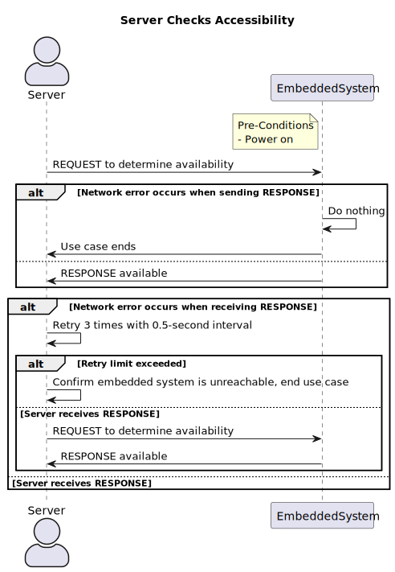

## Case: Server Checks Whether the Embedded System is Reachable

| Author     | Version | Statue    | Date       |
| ---------- | ------- | --------- | ---------- |
| Aidan, Bob | 1       | Unaudited | 2023-03-21 |

### Brief Introduction

When the server wants to check if the embedded system is reachable, it sends an HTTP request message to the embedded system, and the process begins. When the server receives a response message from the embedded system, the process ends.

### Actors

- Server

### Pre-Conditions

- The embedded system has been powered on.

### Basic Flow

1. The server sends an  **REQUEST** message to the embedded system to determine whether the embedded system is available.
2. The embedded system receives the request sent by the server.
3. The embedded system send the **RESPONSE** message to the server.
4. The server receives the response message.

### Exception Flows

- 3a:
  1. When the embedded system send the response, a network error occurs.
  2. The embedded system do nothing, use case ends.

- 4a:
  1. When the server receives the response message, a network error occurs.
  2. The server makes another attempt to send a **REQUEST**, server will retry for at most three times. There should be a 5-second interval between two **REQUESTs**. If server get the **RESPONSE** from the embedded system, return to Basic Flow step 4.
  3. After server has been failed to connect for three times, server confirms that the embedded system is unreachable, use case ends.

### Post Conditions

1. The server confirms that the embedded system is working properly and accessible.

In Exception Flow 4a, server confirms that the embedded system is inaccessible.

### Supplemental Requirements

1. The Reachability check will be used under many conditions. For example, when a user checks whether an embedded system is connected to the network, the server needs to have a clear understanding of the accessibility of the embedded system, so the server begins a reachability check.
2. During communication, we require that **REQUEST** and **RESPONSE** must correspond one-to-one. Otherwise, it indicates that a network failure has occurred and Exception Flows are triggered. (This constraint applies to all communication issues mentioned later.)

### Visual Model

### Sequence Diagram

### Revision History

| Version | Date       | Author     | Description      | Status    |
| ------- | ---------- | ---------- | ---------------- | --------- |
| 1       | 2023-03-21 | Aidan, Bob | Original Version | Unaudited |
