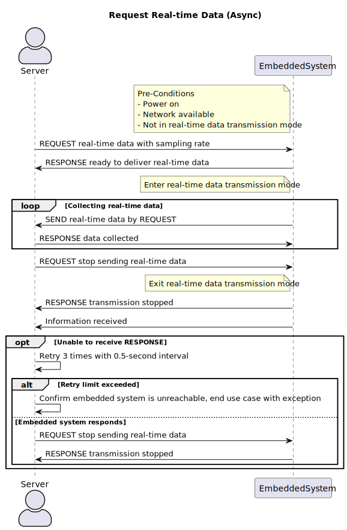

## Case: Server Requests Real-time Data (Async)

| Author     | Version | Statue    | Date       |
| ---------- | ------- | --------- | ---------- |
| Aidan, Bob | 1       | Unaudited | 2023-03-21 |

### Brief Introduction

When the server requests the data that the sensor starts detecting, the process starts; When the server requests to stop transmitting data, the process ends.

### Actors

- Server

### Pre-Conditions

- The embedded system has been powered on.

- The network is available and the server is able to send messages to the embedded system.
- The embedded system is not in **real-time data transmission mode**.

### Basic Flow

1. The server **REQUESTs** to obtain real-time data, with the sampling rate attached.
1. The embedded system gets the **REQUEST** and send the **RESPONSE** that it is ready to deliver real-time data.
1. The embedded system enters **real-time data transmission mode**.
1. The embedded system gets real-time data and **SEND(by REQUEST)** it back to server.
1. the server get the real-time data and **RESPONSE** to the embedded system that the data is collected.
1. Repeat steps 3 and 4 for several times until the server no longer wants to continue receiving data.
4. The server **REQUESTs** to stop sending real-time data.
4. The embedded system stop the detection of real-time data, the embedded system exits **real-time data transmission mode**.
4. The embedded system **RESPONSE** to server that the transmission has been stopped.
4. The server receives the information.

### Exception Flows

- 10a：If the server can not receives the **RESPONSE** from the embedded system.
  1. The server resend the **REQUEST** as in Basic Flow step 7 for at most three times, if the server gets the **RESPONSE** from the embedded system, use case ends normally. There should be a 0.5-second interval between two **REQUESTs**.
  2. After three unsuccessful attempts, the server determines that the embedded system is unreachable, use case ends with exception.

### Post Conditions

1. Data received should be cached by the server.
2. The embedded system quits **real-time data transmission mode** after the Basic Flow.

For Exception Flow 10a, The server detected the embedded system offline.

### Supplemental Requirements

1. Real-time data feedback function is mainly used for recording user data, and the server needs to cache the received data. After the data recording is finished, the user can choose to "upload data" or "discard data". If the user chooses to "upload data", the server will send the data to the database system. Otherwise, the server will delete the cache.
2. Sampling rate is no more than five times per second, due to hardware constraints.
3. Depending on the network environment, the latency of real-time data may vary. Generally, real-time data has a delay of around 200 milliseconds.
4. When the embedded system is in **real-time data transmission mode**, it **CAN** still process other data inquiries (such as the reachability check and sensor details) from the server. However, when the embedded system is in real-time data transmission mode, real-time data transmission requests from the server will be ignored.
5. When the embedded system is in **real-time data transmission mode**, it **CANNOT** make calibration.

### Visual Model

### Sequence Diagram

### Revision History

| Version | Date       | Author     | Description      | Status    |
| ------- | ---------- | ---------- | ---------------- | --------- |
| 1       | 2023-03-21 | Aidan, Bob | Original Version | Unaudited |

