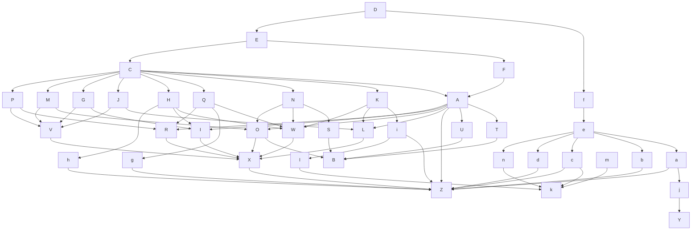
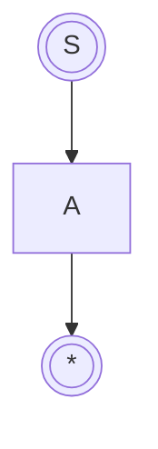
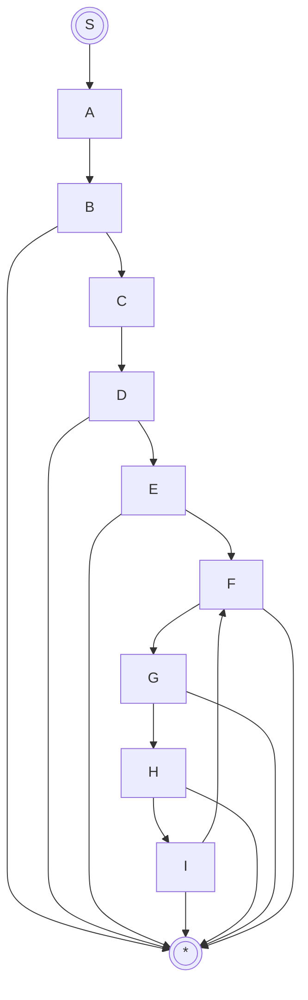
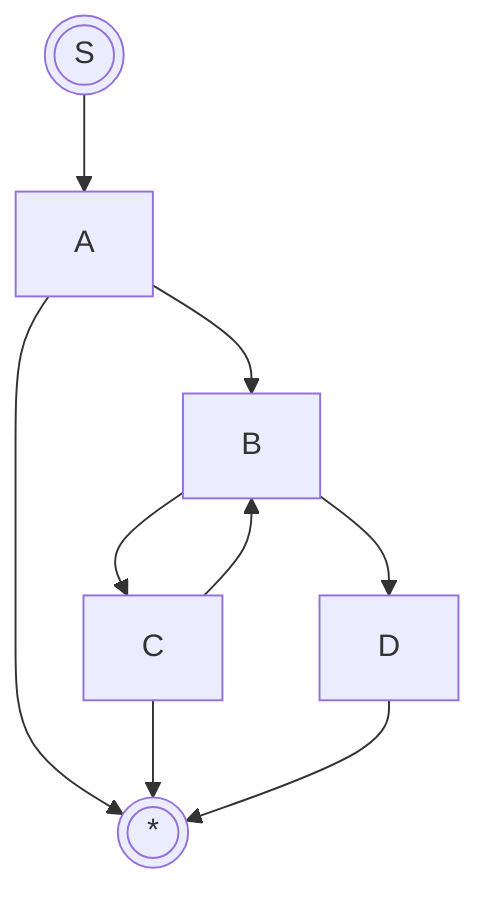
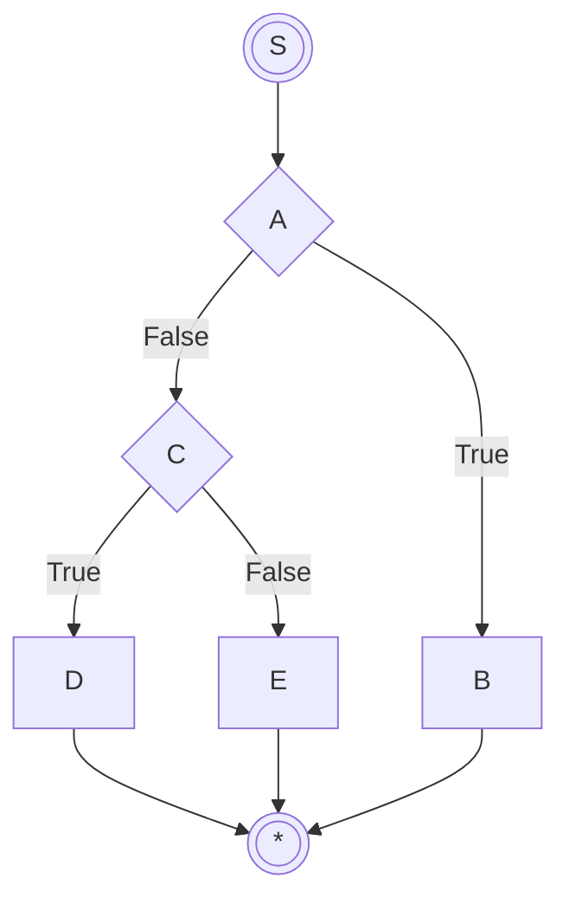
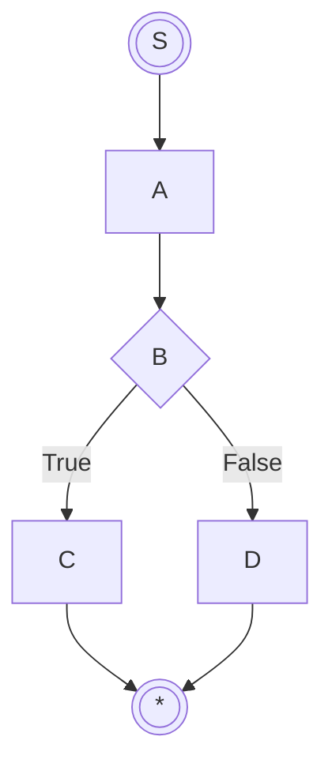
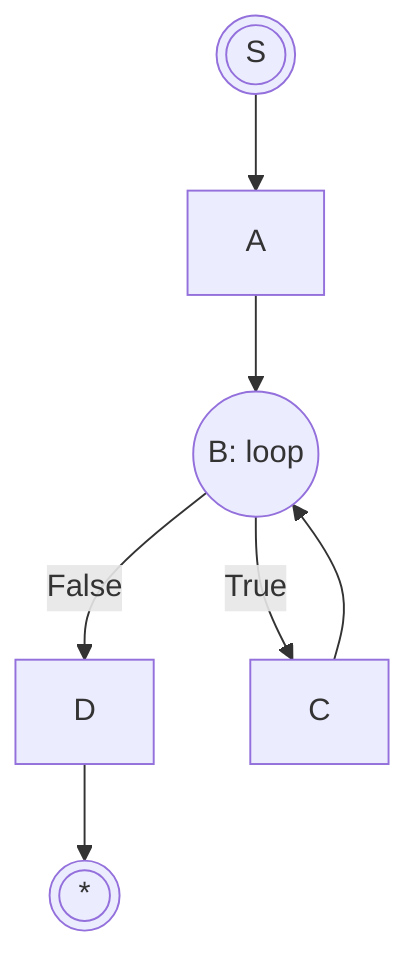
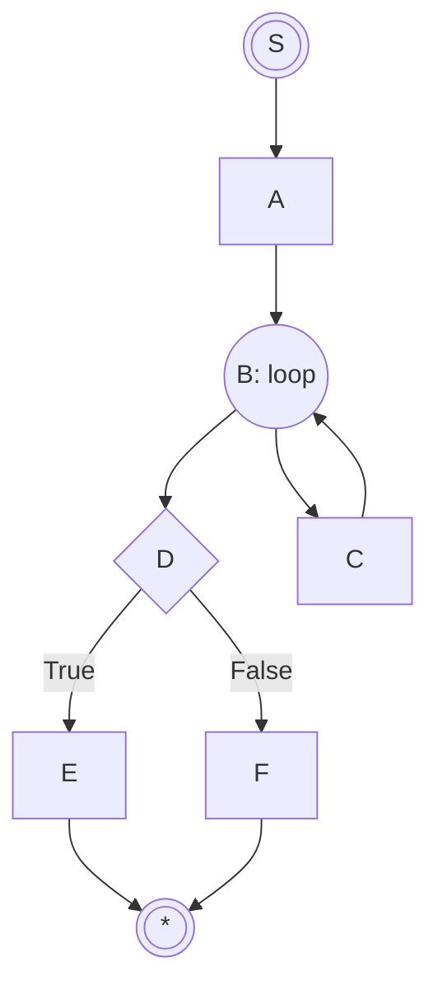
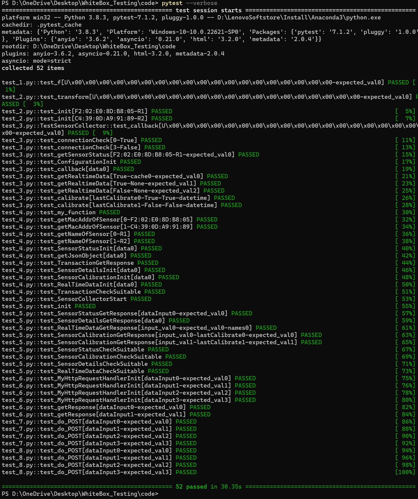
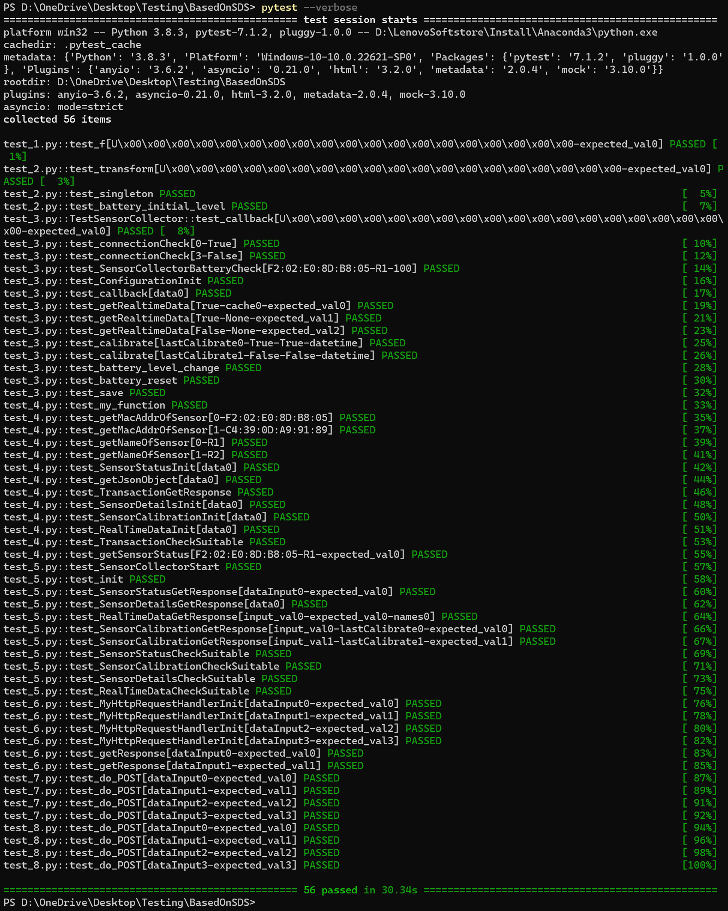

# White-box Testing Document

| Date   | Author     | Description                                                  |
| :----- | :--------- | :----------------------------------------------------------- |
| May 9  | Zin, Aidan | The first round of white-box testing                         |
| May 10 | Zin, Aidan | The second round of white-box testing                        |
| May 14 | Zin, Aidan | The first round of white-box testing for the newly added code that returns battery level. |
| May 15 | Zin, Aidan | The second round of white-box testing for the newly added code that returns battery level. |

[TOC]

## 1. The structure of our codes



| Node Name | Function                                                     |
| --------- | ------------------------------------------------------------ |
| A         | `Router.__init__(self)`                                      |
| B         | `Configuration.__init__(self)`                               |
| C         | `Router.getResponse(self, dataInput)`                        |
| D         | `Router.start(self, ip, port)`                               |
| E         | `MyHttpRequestHandler.do_POST(self)`                         |
| F         | `MyHttpRequestHandler.__init__(self, request, client_address, server, routerObj)` |
| G         | `SensorCalibration.checkSuitable(self, dataInput)`           |
| H         | `SensorCalibration.getResponse(self, dataInput)`             |
| I         | `SensorCalibration.__init__(self, sensorCollectorList)`      |
| J         | `SensorStatus.checkSuitable(self, dataInput)`                |
| K         | `SensorStatus.getResponse(self, dataInput)`                  |
| L         | `SensorStatus.__init__(self, sensorCollectorList)`           |
| M         | `SensorDetails.checkSuitable(self, dataInput)`               |
| N         | `SensorDetails.getResponse(self, dataInput)`                 |
| O         | `SensorDetails.__init__(self, sensorCollectorList)`          |
| P         | `RealTimeData.checkSuitable(self, dataInput)`                |
| Q         | `RealTimeData.getResponse(self, dataInput)`                  |
| R         | `RealTimeData.__init__(self, sensorCollectorList)`           |
| S         | `Configuration.getJsonObject(self)`                          |
| T         | `Configuration.getMacAddrOfSensor(self, index)`              |
| U         | `Configuration.getNameOfSensor(self, index)`                 |
| V         | `Transaction.checkSuitable(self, dataInput)`                 |
| W         | `Transaction.getResponse(self, dataInput)`                   |
| X         | `Transaction.__init__(self, sensorCollectorList)`            |
| Y         | `Plugin.f(data)`                                             |
| Z         | `SensorCollector.__init__(self, macAddr, name)`              |
| a         | `SensorCollector.__callback(self, sender, data)`             |
| b         | `SensorCollector.__connectionCheck(self)`                    |
| c         | `SensorCollector.__batteryCheck(self, client)`               |
| d         | `SensorCollector.__calibrate(self, client)`                  |
| e         | `SensorCollector.__start_raw(self)`                          |
| f         | `SensorCollector.start(self)`                                |
| g         | `SensorCollector.getRealtimeData(self)`                      |
| h         | `SensorCollector.calibrate(self)`                            |
| i         | `SensorCollector.getSensorStatus(self)`                      |
| j         | `DataTransform.transform(self, data)`                        |
| k         | `Battery.__init__(self) `                                    |
| l         | `Battery.batterycheck(self)`                                 |
| m         | `Battery.reset(self)`                                        |
| n         | `Battery.save(self)`                                         |

## 2. Test Plan

We take an **incremental testing approach**: a **bottom-up integration approach**. In this way, the next module to be tested can be tested in combination with those modules that have been tested, and so on, adding one module at a time. This approach essentially accomplishes **unit testing** and **integration testing** at the same time. At the same time, we use the **conditional combination coverage** in logic coverage to write test cases.

According to our function call relationship diagram, it is divided into **eight layers** from bottom to top. We test all functions **from bottom to top** according to the hierarchy, and there is no requirement for testing order between functions in the same layer.

Therefore, it can be divided into **eight test sets**, each containing all white-box testing cases in that layer.

- **First Test**

  (1) `Plugin.f(data)`

- **Second Test**

  (2) `DataTransform.transform(self, data)`

  (3) `SensorCollector.__init__(self, macAddr, name)`

  (37) `Battery.__init__(self)`

- **Third Test**

  (4) `SensorCollector.__callback(self, sender, data)`

  (5) `SensorCollector.__connectionCheck(self)`

  (6) `SensorCollector.__batteryCheck(self, client)`

  (7) `SensorCollector.__calibrate(self, client)`

  (9) `Configuration.__init__(self)`

  (10) `Transaction.__init__(self, sensorCollectorList)`

  (11) `SensorCollector.getRealtimeData(self)`

  (12) `SensorCollector.calibrate(self)`

  (38) `Battery.batterycheck(self)`

  (39) `Battery.reset(self)`

  (40) `Battery.save(self)`

- **Forth Test**

  **(13) `SensorCollector.__start_raw(self)`**

  (14) `Configuration.getMacAddrOfSensor(self, index)`

  (15) `Configuration.getNameOfSensor(self, index)`

  (16) `SensorStatus.__init__(self, sensorCollectorList)`

  (17) `Configuration.getJsonObject(self)`

  (18) `Transaction.getResponse(self, dataInput)`

  (19) `SensorDetails.__init__(self, sensorCollectorList)`

  (20) `SensorCalibration.__init__(self, sensorCollectorList)`

  (21) `RealTimeData.__init__(self, sensorCollectorList)`

  (22) `Transaction.checkSuitable(self, dataInput)`

  (8) `SensorCollector.getSensorStatus(self)`

- **Fifth Test**

  (23) `SensorCollector.start(self)`

  (24) `Router.__init__(self)`

  (25) `SensorStatus.getResponse(self, dataInput)`

  (26) `SensorDetails.getResponse(self, dataInput)`

  (27) `RealTimeData.getResponse(self, dataInput)`

  (28) `SensorCalibration.getResponse(self, dataInput)`

  (29) `SensorStatus.checkSuitable(self, dataInput)`

  (30) `SensorCalibration.checkSuitable(self, dataInput)`

  (31) `SensorDetails.checkSuitable(self, dataInput)`

  (32) `RealTimeData.checkSuitable(self, dataInput)`

- **Sixth Test**

  (33) `MyHttpRequestHandler.__init__(self, request, client_address, server, routerObj)`

  (34) `Router.getResponse(self, dataInput)`

- **Seventh Test**

  (35) `MyHttpRequestHandler.do_POST(self)`

- **Eighth Test**

  (36) `Router.start(self, ip, port)`


## 3. Test Cases

> **Regulations:** `S` in the figure represents the function entry, and `*` represents the function return

### 3.1 First Test

**(1) `Plugin.f(data)`**

  ```mermaid
  graph TD
  S(((S))) --> A --> B --> C --> D --> *(((*)));
  A --> *;
  C --> *;
  ```

| Case Number | Test Case                                                    | Coverage Conditions      | Overlay Path | Expected Results                                             |
| :---------- | ------------------------------------------------------------ | ------------------------ | ------------ | ------------------------------------------------------------ |
| 1           | `b'x55xb8xadxe6x96x87'`                                      | [(A, C):`(True, False)`] | SABC*        | `None`                                                       |
| 2           | `b'xe4xb8xadxe6x96x87xe4xb8xadxe6x96x87xe4xb8xadxe6x96x87x96x87'` | [(A, C):`(False, True)`] | SA*          | `None`                                                       |
| 3           | `b'x55x00x00x00x00x00x00x00x00x0x00x00x00x00x00x00x00x00x00x00'` | [(A, C): `(True, True)`] | SABCD*       | `{  "X"   : 0, "Y"   : 0, "Z"   : 0,     "accX": 0  , "accY": 0  , "accZ":0, "asX" : 0  , "asY" : 0  , "asZ" : 0 }` |

### 3.2 Second Test

**(2) `DataTransform.transform(self, data)`**

  ```mermaid
  graph TD
  S(((S))) --> A --> *(((*)));
  ```

| Case Number | Test Case                                                    | Coverage Conditions | Overlay Path | Expected Results                                             |
| :---------- | ------------------------------------------------------------ | ------------------- | ------------ | ------------------------------------------------------------ |
| 1           | `b'x55x00x00x00x00x00x00x00x00x0x00x00x00x00x00x00x00x00x00x00` | No Condition        | SA*          | `{  "X"   : 0, "Y"   : 0, "Z"   : 0,     "accX": 0  , "accY": 0  , "accZ":0, "asX" : 0  , "asY" : 0  , "asZ" : 0 }` |

**(3) `SensorCollector.__init__(self, macAddr, name)`**

 ```mermaid
  graph TD;
  	S(((S))) -->A;
      A-->*(((*)));
 ```

| Case Number | Test Case                                       | Coverage Conditions | Overlay Path | Expected Results                                             |
| :---------- | ----------------------------------------------- | ------------------- | ------------ | ------------------------------------------------------------ |
| 1           | macAddr = `"F2:02:E0:8D:B8:05"`, name =  `"R1"` | no condition        | SA*          | macAddr = `"F2:02:E0:8D:B8:05"`, name = `"R1"`, cache = `None`, type(cacheTime) = `datetime.datetime`, needCalibrate =` False`, type(lastCalibrate) = `datetime.datetime`, connected = `False`, battery = `0` |

**(37) `Battery.__init__(self)`**



| Case Number | Test Case | Coverage Conditions | Overlay Path | Expected Results               |
| :---------- | --------- | ------------------- | ------------ | ------------------------------ |
| 1           | None      | no condition        | SA*          | `battery.batterycheck() = 100` |

### 3.3 Third Test

**(4) `SensorCollector.__callback(self, sender, data)`**

  ```mermaid
   graph TD;
   	S(((S))) -->A;
       A-->*(((*)));
  ```

| Case Number | Test Case                                                    | Coverage Conditions | Overlay Path | Expected Results                                             |
| :---------- | ------------------------------------------------------------ | ------------------- | ------------ | ------------------------------------------------------------ |
| 1           | sender = `None` , data = `b'x55x00x00x00x00x00x00x00x00x0x00x00x00x00x00x00x00x00x00x00` | No Conditions       | SA*          | cache = {  "X"   : 0, "Y"   : 0, "Z"   : 0,     "accX": 0  , "accY": 0  , "accZ":0, "asX" : 0  , "asY" : 0  , "asZ" : 0 }, type(cacheTime) = `datetime.datetime` |

**(5) `SensorCollector.__connectionCheck(self)`**

  ```mermaid
  graph TD
  S(((S))) --> A --> B;
  B --> C --> *(((*)));
  B --> D --> *
  ```

| Case Number | Test Case                                  | Coverage Conditions | Overlay Path | Expected Results |
| :---------- | ------------------------------------------ | ------------------- | ------------ | ---------------- |
| 1           | `delta.total_seconds()` > `TIME_OUT_SPAN`  | [B:`True`]          | SABC*        | `False`          |
| 2           | `delta.total_seconds()` <= `TIME_OUT_SPAN` | [B:`False`]         | SABD*        | `True`           |

**(6) `SensorCollector.__batteryCheck(self, client)`**

```python
def __batteryCheck(self, client: BleakClient) -> int:  # TODO: read battery
    # print(self.cache)
    return 100
```

  ```mermaid
  graph TD
  S(((S))) --> *(((*)));
  ```

> Obviously, there's no problem with the code.

**(7) `SensorCollector.__calibrate(self, client)`**

```python
def __calibrate(self, client) -> None:  # TODO: calibrate
    self.needCalibrate = False
```


  ```mermaid
  graph TD
  S(((S))) --> *(((*)));
  ```

> Obviously, there's no problem with the code.

**(9) `Configuration.__init__(self)`**



| Case Number | Test Case                                                    | Coverage Conditions                      | Overlay Path | Expected Results |
| ----------- | ------------------------------------------------------------ | ---------------------------------------- | ------------ | ---------------- |
| 1           | config.json : `无`                                           | [B :`False`]                             | SAB*         | None             |
| 2           | config.json : 999                                            | [(B, D) : ( `True ,False`]               | SABCD*       | None             |
| 3           | config.json : [{},{},{},{},{},{},{}]                         | [(B,D, E ):`(True, True, False)`]        | SABCDE*      | None             |
| 4           | config.json : [[1, 4, 6]]                                    | [(B,D,E,G):`(True, True, False, False)`] | SABCDEFG     | None             |
| 5           | config.json : [{"name": "R1", "macAddr": "F2:02:E0:8D:B8:05"}] | [(B,D,E,G):`(True, True, True, True)`]   | SABCDEFGHIF* | None             |

**(10) `Transaction.__init__(self, sensorCollectorList)`**



| Case Number | Test Case                                                    | Coverage Conditions                            | Overlay Path | Expected Results                                             |
| :---------- | ------------------------------------------------------------ | ---------------------------------------------- | ------------ | ------------------------------------------------------------ |
| 1           | sensorCollectorList = `666`                                  | [A : `False`]                                  | SA*          | sensorCollectorList = `None`                                 |
| 2           | sensorCollectorList = `[SensorCollector("F2:02:E0:8D:B8:05", "R1")]` | [(A, B1, B2, C) : `(True, True, False), True`] | SABCBD*      | sensorCollectorList =`[SensorCollector("F2:02:E0:8D:B8:05", "R1")]` |
| 3           | `sensorCollectorList = [2]`                                  | [(A, C) :`(True, False)`]                      | SABC*        | sensorCollectorList = `None`                                 |

**(11) `SensorCollector.getRealtimeData(self)`**



| Case Number | Test Case                                                    | Coverage Conditions            | Overlay Path | Expected Results                                             |
| ----------- | ------------------------------------------------------------ | ------------------------------ | ------------ | ------------------------------------------------------------ |
| 1           | connected = `True`; cache = `{"X":1, "Y":1, "Z":1, "accX":1, "accY":1, "accZ":1, "asX":1, "asY":1, "asZ":1}` | `connected, cache is not None` | SACD*        | `{"X":1, "Y":1, "Z":1, "accX":1, "accY":1, "accZ":1, "asX":1, "asY":1, "asZ":1}` |
| 2           | connected = `True`; cache = `None`                           | `connected, cache is None`     | SACE*        | `INVALID_DATA`                                               |
| 3           | connected = `False`                                          | `not connected `               | SAB*         | `INVALID_DATA`                                               |

**(12) `SensorCollector.calibrate(self)`**



| Case Number | Test Case                                               | Coverage Conditions                           | Overlay Path | Expected Results                                             |
| ----------- | ------------------------------------------------------- | --------------------------------------------- | ------------ | ------------------------------------------------------------ |
| 1           | lastCalibrate = `datetime.datetime.utcfromtimestamp(0)` | `deltaTime.total_seconds() > CALIBRATE_SPAN`  | SABC*        | `type(lastCalibrate) = datetime.datetime; needCalibrate = True; returnValue = True;` |
| 2           | lastCalibrate = `datetime.datetime.utcnow()`            | `deltaTime.total_seconds() <= CALIBRATE_SPAN` | SABD*        | `type(lastCalibrate) = datetime.datetime;  returnValue = False;` |

**(38) `Battery.batterycheck(self)`**


| Case Number | Test Case                                                    | Coverage Conditions | Overlay Path | Expected Results              |
| :---------- | ------------------------------------------------------------ | ------------------- | ------------ | ----------------------------- |
| 1           | `datetime.datetime.now().timestamp() - battery.data['timing']['beginning'] == 600` | no condition        | SA*          | `battery.batterycheck() = 90` |

**(39) `Battery.reset(self)`**


| Case Number | Test Case                               | Coverage Conditions | Overlay Path | Expected Results               |
| :---------- | --------------------------------------- | ------------------- | ------------ | ------------------------------ |
| 1           | `battery.data['battery']['level'] = 50` | no condition        | SA*          | `battery.batterycheck() = 100` |

**(40) `Battery.save(self)`**


| Case Number | Test Case                               | Coverage Conditions | Overlay Path | Expected Results                |
| :---------- | --------------------------------------- | ------------------- | ------------ | ------------------------------- |
| 1           | `battery.data['battery']['level'] = 50` | no condition        | SA*          | `data['battery']['level'] = 50` |


### 3.4 Forth Test

**(13) `SensorCollector.__start_raw(self)`**

In the testing, we used `pytest` and `MagicMock` to simulate the `BleakClient` class, and `AsyncMock` to simulate some methods of the `BleakClient` class, such as `connect`, `start_ notify`、`write_ gatt_char` and so on. Then, we called the`__ start_raw (client)` method simulates the process of interaction between the `BleakClient` object and the incoming parameter `client`.
Finally, we use various `assert` statements to check whether the simulated method is correctly called to ensure the correctness and stability of the method.

**(14) `Configuration.getMacAddrOfSensor(self, index)`**

  ```mermaid
  graph TD
  S(((S))) --> A --> B --> C --> *(((*)));
  B --> *;
  A --> *;
  ```

| Case Number | Test Case | Coverage Conditions       | Overlay Path | Expected Results      |
| :---------- | --------- | ------------------------- | ------------ | --------------------- |
| 1           | -1        | [(A, B): `(False, True)`] | SA*          | `None`                |
| 2           | 6         | [(A, B): `(True, False)`] | SAB*         | `None`                |
| 3           | 0         | [(A, B): `(True, True)`]  | SABC*        | `"F2:02:E0:8D:B8:05"` |

**(15) `Configuration.getNameOfSensor(self, index)`**

  ```mermaid
  graph TD
  S(((S))) --> A --> B --> C --> *(((*)));
  B --> *;
  A --> *;
  ```

| Case Number | Test Case | Coverage Conditions       | Overlay Path | Expected Results |
| :---------- | --------- | ------------------------- | ------------ | ---------------- |
| 1           | -1        | [(A, B):`(False, True)`]  | SA*          | `None`           |
| 2           | 6         | [(A, B): `(True, False)`] | SAB*         | `None`           |
| 3           | 0         | [(A, B): `(True, True)`]  | SABC*        | `"R1"`           |

**(16) `SensorStatus.__init__(self, sensorCollectorList)`**

  ```mermaid
   graph TD;
   	S(((S))) -->A;
       A-->*(((*)));
  ```

| Case Number | Test Case                                                    | Coverage Conditions | Overlay Path | Expected Results                                             |
| :---------- | ------------------------------------------------------------ | ------------------- | ------------ | ------------------------------------------------------------ |
| 1           | sensorCollectorList = `[SensorCollector("F2:02:E0:8D:B8:05", "R1")]` | no condition        | SA*          | sensorCollectorList =`[SensorCollector("F2:02:E0:8D:B8:05", "R1")]` |

**(17) `Configuration.getJsonObject(self)`**


| Case Number | Test Case                                                    | Coverage Conditions | Overlay Path | Expected Results                                             |
| ----------- | ------------------------------------------------------------ | ------------------- | ------------ | ------------------------------------------------------------ |
| 1           | data = `[ {"name": "R1", "macAddr": "F2:02:E0:8D:B8:05"},{"name": "R2", "macAddr": "C4:39:0D:A9:91:89"}, {"name": "R3", "macAddr": "E8:67:FE:A6:D4:3C", {"name": "L1", "macAddr": "D1:7A:2A:54:02:95"}, {"name": "L2", "macAddr": "D7:0F:4F:1D:4F:B5"}, {"name": "L3", "macAddr": "E6:7A:B7:B0:45:9D"}]` | no condition        | SA*          | `[ {"name": "R1", "macAddr": "F2:02:E0:8D:B8:05"},{"name": "R2", "macAddr": "C4:39:0D:A9:91:89"}, {"name": "R3", "macAddr": "E8:67:FE:A6:D4:3C", {"name": "L1", "macAddr": "D1:7A:2A:54:02:95"}, {"name": "L2", "macAddr": "D7:0F:4F:1D:4F:B5"}, {"name": "L3", "macAddr": "E6:7A:B7:B0:45:9D"}]` |

**(18) `Transaction.getResponse(self, dataInput)`**


| Case Number | Test Case                                         | Coverage Conditions | Overlay Path | Expected Results |
| ----------- | ------------------------------------------------- | ------------------- | ------------ | ---------------- |
| 1           | dataInput = `{"name": "test", "macAddr": "test"}` | no condition        | SA*          | `ERROR_MESSAGE`  |

**(19) `SensorDetails.__init__(self, sensorCollectorList)`**


| Case Number | Test Case                                                    | Coverage Conditions | Overlay Path | Expected Results                                             |
| :---------- | ------------------------------------------------------------ | ------------------- | ------------ | ------------------------------------------------------------ |
| 1           | sensorCollectorList = `[SensorCollector("F2:02:E0:8D:B8:05", "R1")]`， config = `Configuration()` | no condition        | SA*          | sensorCollectorList =`[SensorCollector("F2:02:E0:8D:B8:05", "R1")]`, self.config = `Configuration()` |

**(20) `SensorCalibration.__init__(self, sensorCollectorList)`**

  ```mermaid
   graph TD;
   	S(((S))) -->A;
       A-->*(((*)));
  ```

| Case Number | Test Case                                                    | Coverage Conditions | Overlay Path | Expected Results                                             |
| :---------- | ------------------------------------------------------------ | ------------------- | ------------ | ------------------------------------------------------------ |
| 1           | sensorCollectorList = `[SensorCollector("F2:02:E0:8D:B8:05", "R1")]` | no condition        | SA*          | sensorCollectorList =`[SensorCollector("F2:02:E0:8D:B8:05", "R1")]` |

**(21) `RealTimeData.__init__(self, sensorCollectorList)`**

  ```mermaid
   graph TD;
   	S(((S))) -->A;
       A-->*(((*)));
  ```

| Case Number | Test Case                                                    | Coverage Conditions | Overlay Path | Expected Results                                             |
| :---------- | ------------------------------------------------------------ | ------------------- | ------------ | ------------------------------------------------------------ |
| 1           | sensorCollectorList = `[SensorCollector("F2:02:E0:8D:B8:05", "R1")]` | no condition        | SA*          | sensorCollectorList =`[SensorCollector("F2:02:E0:8D:B8:05", "R1")]` |

**(22) `Transaction.checkSuitable(self, dataInput)`**

  ```mermaid
  graph TD;
  	S(((S)))-->A;
      A-->*(((*)));
  ```

| Case Number | Test Case                                         | Coverage Conditions | Overlay Path | Expected Results |
| ----------- | ------------------------------------------------- | ------------------- | ------------ | ---------------- |
| 1           | dataInput = `{"name": "test", "macAddr": "test"}` | no condition        | SA*          | `False`          |

**(8) `SensorCollector.getSensorStatus(self)`**


| Case Number | Test Case                         | Coverage Conditions | Overlay Path | Expected Results                   |
| ----------- | --------------------------------- | ------------------- | ------------ | ---------------------------------- |
| 1           | `connected = False; battery = 0;` | no condition        | SA*          | `{"connect": False, "battery": 0}` |

### 3.5 Fifth Test

**(23) `SensorCollector.start(self)`**

```python
def start(self):
    self.thread = threading.Thread(target=lambda: asyncio.run(self.__start_raw()))
    self.thread.start()
```

Obviously, the correctness of this function itself depends on the correctness of function `SensorCollector.__start__raw(self)`.

**(24) `Router.__init__(self)`**

  ```mermaid
  graph TD
  S(((S))) --> A --> B --> D --> *(((*)));
  B --> C --> B;
  ```

| Case Number | Test Case | Coverage Conditions | Overlay Path      | Expected Results                                             |
| :---------- | --------- | ------------------- | ----------------- | ------------------------------------------------------------ |
| 1           | `None`    | No Conditions       | SABCBCBCBCBCBCBD* | [`RealTimeData(self.sensorCollectorList)`,    `SensorDetails(self.sensorCollectorList, self.config)`,    `SensorStatus(self.sensorCollectorList)`,    `SensorCalibration(self.sensorCollectorList)`]` |

**(25) `SensorStatus.getResponse(self, dataInput)`**

 ```mermaid
    flowchart TD;
        S(((S)))-->A;
        A-->B((B: loop));
        B-->D;
        B-->C;
        C-->B;
        D-->*(((*)));
 ```

| Case Number | Test Case                                | Coverage Conditions | Overlay Path | Expected Results                                             |
| ----------- | ---------------------------------------- | ------------------- | ------------ | ------------------------------------------------------------ |
| 1           | dataInput = `{"type":"GetSensorStatus"}` | no condition        | SABC..BD*    | `{'0': {'connect': False, 'battery': 100.0},'1': {'connect': False, 'battery': 100.0},'2': {'battery': 100.0, 'connect': False},'3': {'battery': 100.0, 'connect': False},'4': {'battery': 100.0, 'connect': False},'5': {'battery': 100.0, 'connect': False}}` |

**(26) `SensorDetails.getResponse(self, dataInput)`**


| Case Number | Test Case                                      | Coverage Conditions | Overlay Path | Expected Results                                             |
| ----------- | ---------------------------------------------- | ------------------- | ------------ | ------------------------------------------------------------ |
| 1           | dataInput = `{    "type":"GetSensorDetails" }` | no condition        | SA*          | `[{"name": "R1","macAddr": "F2:02:E0:8D:B8:05"},{"name": "R2","macAddr": "C4:39:0D:A9:91:89"},{"name": "R3","macAddr": "E8:67:FE:A6:D4:3C"},{"name": "L1","macAddr": "D1:7A:2A:54:02:95"},{"name": "L2","macAddr": "D7:0F:4F:1D:4F:B5"},{"name": "L3","macAddr": "E6:7A:B7:B0:45:9D"}]` |

**(27) `RealTimeData.getResponse(self, dataInput)`**



| Case Number | Test Case                                | Coverage Conditions | Overlay Path | Expected Results                                             |
| ----------- | ---------------------------------------- | ------------------- | ------------ | ------------------------------------------------------------ |
| 1           | dataInput = `{"type":"GetRealtimeData"}` | no condition        | SABC..BD*    | `{"R1": INVALID_DATA, "R2": INVALID_DATA, "R3": INVALID_DATA, "L1": INVALID_DATA, "L2": INVALID_DATA, "L3": INVALID_DATA, 'timestamp': (a float)}` |

**(28) `SensorCalibration.getResponse(self, dataInput)`**


| Case Number | Test Case                                                    | Coverage Conditions | Overlay Path | Expected Results                 |
| ----------- | ------------------------------------------------------------ | ------------------- | ------------ | -------------------------------- |
| 1           | dataInput = `{"type":"SensorCalibration"}` & 6 sensors have been calibrated for `more than 10 seconds` since the last calibration | `ans is True`       | SABC..BDE*   | `{"type": "CalibrationSuccess"}` |
| 2           | dataInput = `{"type":"SensorCalibration"}` & Six sensors were just calibrated `within 10 seconds` | `ans is False`      | SABC..BDF*   | `{"type": "CalibrationFailure"}` |

**(29) `SensorStatus.checkSuitable(self, dataInput)`**


| Case Number | Test Case                                 | Coverage Conditions | Overlay Path | Expected Results |
| ----------- | ----------------------------------------- | ------------------- | ------------ | ---------------- |
| 1           | dataInput = `{"type": "GetSensorStatus"}` | no condition        | SA*          | `True`           |

**(30) `SensorCalibration.checkSuitable(self, dataInput)`**


| Case Number | Test Case                                   | Coverage Conditions | Overlay Path | Expected Results |
| ----------- | ------------------------------------------- | ------------------- | ------------ | ---------------- |
| 1           | dataInput = `{"type": "SensorCalibration"}` | no condition        | SA*          | `True`           |

**(31) `SensorDetails.checkSuitable(self, dataInput)`**


| Case Number | Test Case                                  | Coverage Conditions | Overlay Path | Expected Results |
| ----------- | ------------------------------------------ | ------------------- | ------------ | ---------------- |
| 1           | dataInput = `{"type": "GetSensorDetails"}` | no condition        | SA*          | `True`           |

**(32) `RealTimeData.checkSuitable(self, dataInput)`**


| Case Number | Test Case                                 | Coverage Conditions | Overlay Path | Expected Results |
| ----------- | ----------------------------------------- | ------------------- | ------------ | ---------------- |
| 1           | dataInput = `{"type": "GetRealtimeData"}` | no condition        | SA*          | `True`           |

### 3.6 Sixth Test

**(33) `MyHttpRequestHandler.__init__(self, request, client_address, server, routerObj)`**

  ```mermaid
   graph TD;
   	S(((S))) -->A;
       A-->*(((*)));
  ```

| Case Number | Test Case            | Coverage Conditions | Overlay Path | Expected Results  |
| :---------- | -------------------- | ------------------- | ------------ | ----------------- |
| 1           | routerObj = Router() | No Condition        | SA*          | router = Router() |

**(34) `Router.getResponse(self, dataInput)`**

```mermaid
  flowchart TD;
      S(((S)))-->A;
      A-->B((B: loop));
      B--True-->C{C};
      C--True-->D;
      C--False-->B;
      B--False-->*(((*)));
      D-->*(((*)));
```

| Case Number | Test Case                                  | Coverage Conditions                            | Overlay Path | Expected Results                                             |
| ----------- | ------------------------------------------ | ---------------------------------------------- | ------------ | ------------------------------------------------------------ |
| 1           | dataInput = `{"type": "GetSensorDetails"}` | `transcation.checkSuitable(dataInput) = True`  | SABC..BCD*   | `[{"name": "R1","macAddr": "F2:02:E0:8D:B8:05"},{"name": "R2","macAddr": "C4:39:0D:A9:91:89"},{"name": "R3","macAddr": "E8:67:FE:A6:D4:3C"},{"name": "L1","macAddr": "D1:7A:2A:54:02:95"},{"name": "L2","macAddr": "D7:0F:4F:1D:4F:B5"},{"name": "L3","macAddr": "E6:7A:B7:B0:45:9D"}]` |
| 2           | dataInput = `{"type": "Test"}`             | `transcation.checkSuitable(dataInput) = False` | SABCB*       | `{'type': 'TypeError'}`                                      |


### 3.7 Seventh Test

**(35) `MyHttpRequestHandler.do_POST(self)`**

```mermaid
    graph TD;
        S(((S)))-->A;
        A--Success-->B{B};
        A--Failure-->F;
        B--True-->C;
        B--False-->D;
        C-->D;
        D--Failure-->F;
        D--Success-->E;
        F-->G;
        E--Success-->G;
        E--Failure-->F;
        G-->*(((*)));
```

| Case Number | Test Case                                                    | Coverage Conditions                           | Overlay Path | Expected Results                                             |
| ----------- | ------------------------------------------------------------ | --------------------------------------------- | ------------ | ------------------------------------------------------------ |
| 1           | client request: `clientRequest({"type": "GetSensorStatus"}, "127.0.0.1", "40096") ` | `A: Success, B: True, D: Success, E: Success` | SABCDEG*     | `response = {'0': {'connect': False, 'battery': 100.0}, '1': {'connect': False, 'battery': 100.0}, '2': {'connect': False, 'battery': 100.0}, '3': {'connect': False, 'battery': 100.0}, '4': {'connect': False, 'battery': 100.0}, '5': {'connect': False, 'battery': 100.0}}` |
| 2           | client request: `clientRequest({"name":"Test"}, "127.0.0.1", "40096") ` | `A: Success, B: True, D: Success, E: Failure` | SABCDEFG*    | `ERROR_MESSAGE`                                              |

### 3.8 Eighth Test

**(36) `Router.start(self, ip, port)`**

  ```mermaid
   graph TD;
   	S(((S))) -->A;
       A-->*(((*)));
  ```

| Case Number | Test Case                          | Coverage Conditions | Overlay Path | Expected Results                           |
| :---------- | ---------------------------------- | ------------------- | ------------ | ------------------------------------------ |
| 1           | ip = `"127.0.0.1"`, port = `40096` | No condition        | SA*          | "Server started on http://127.0.0.1:40096" |

## 4. Description of automated testing tools

We used `Python`'s third-party library, `Pytest`, to complete automated white-box testing.
`Pytest` is a relatively mature and fully functional Python testing framework. It provides comprehensive online documentation, with a large number of third-party plugins and built-in help, suitable for many small or large projects. `Pytest` is flexible and easy to learn, and can capture standard output during print debugging and test execution, making it suitable for simple unit testing to complex functional testing. You can also execute `nose`, `unittest`, and `doctest` style test cases, and even `Django` and `trial`. Support good integration practices, support extended `xUnit` style setups, and support `non Python testing`. Support for generating test coverage reports and supporting `PEP8` compatible encoding styles.
The main features are as follows:

- Simple and flexible, easy to learn, with rich documentation;

- Support parameterization, allowing fine-grained control of the test cases to be tested;

- It can support simple unit testing and complex functional testing, and can also be used for automation testing such as `selenium/appnium` and interface automation testing (`pytest`+`requests`);

- `Pytest` has many third-party plugins and can be customized and extended, such as `pytest-selenium` (integrated selenium), `pytest-html` (perfect HTML test report generation), `pytest-rerunfailures` (repeated execution of failed cases), `pytest-xdist` (multi CPU distribution), etc; 

  > In our testing, we used `pytest-html` to generate a test report: `report.html`.

- Skip and xfail handling of test cases;

- Can be well integrated with CI tools, such as `Jenkins`

- The report framework - alloure also supports `pytest`

## **5. Test Report**

### 5.1 The first round of white-box testing

A total of 52 test items were tested on 36 functions, of which 51 test items of 34 functions passed and 1 test item of 1 function failed.

The details are shown in the table below.

| Id   | Function                                                     | Test Result                                                 | Review                                                       |
| ---- | ------------------------------------------------------------ | ----------------------------------------------------------- | ------------------------------------------------------------ |
| (1)  | `Router.__init__(self)`                                      | **Passed**                                                  |                                                              |
| (2)  | `Configuration.__init__(self)`                               | **Passed**                                                  |                                                              |
| (3)  | `Router.getResponse(self, dataInput)`                        | **Passed**                                                  |                                                              |
| (4)  | `Router.start(self, ip, port)`                               | **Passed**                                                  |                                                              |
| (5)  | `MyHttpRequestHandler.do_POST(self)`                         | **Passed**                                                  |                                                              |
| (6)  | `MyHttpRequestHandler.__init__(self, request, client_address, server, routerObj)` | **Passed**                                                  |                                                              |
| (7)  | `SensorCalibration.checkSuitable(self, dataInput)`           | **Passed**                                                  |                                                              |
| (8)  | `SensorCalibration.getResponse(self, dataInput)`             | **<font color=#FF0000 >Failed on Test Case 2</font>**<br /> | **Analysis:**  *the return value `{"type": " CalibrationFailure"}` had **<font color=#FF0000 >an additional space</font>** before the `CalibrationFailure`*<br />**Modification:** `{"type": " CalibrationFailure"}` -> `{"type": "CalibrationFailure"}` |
| (9)  | `SensorCalibration.__init__(self, sensorCollectorList)`      | **Passed**                                                  |                                                              |
| (10) | `SensorStatus.checkSuitable(self, dataInput)`                | **Passed**                                                  |                                                              |
| (11) | `SensorStatus.getResponse(self, dataInput)`                  | **Passed**                                                  |                                                              |
| (12) | `SensorStatus.__init__(self, sensorCollectorList)`           | **Passed**                                                  |                                                              |
| (13) | `SensorDetails.checkSuitable(self, dataInput)`               | **Passed**                                                  |                                                              |
| (14) | `SensorDetails.getResponse(self, dataInput)`                 | **Passed**                                                  |                                                              |
| (15) | `SensorDetails.__init__(self, sensorCollectorList)`          | **Passed**                                                  |                                                              |
| (16) | `RealTimeData.checkSuitable(self, dataInput)`                | **Passed**                                                  |                                                              |
| (17) | `RealTimeData.getResponse(self, dataInput)`                  | **Passed**                                                  |                                                              |
| (18) | `RealTimeData.__init__(self, sensorCollectorList)`           | **Passed**                                                  |                                                              |
| (19) | `Configuration.getJsonObject(self)`                          | **Passed**                                                  |                                                              |
| (20) | `Configuration.getMacAddrOfSensor(self, index)`              | **Passed**                                                  |                                                              |
| (21) | `Configuration.getNameOfSensor(self, index)`                 | **Passed**                                                  |                                                              |
| (22) | `Transaction.checkSuitable(self, dataInput)`                 | **Passed**                                                  |                                                              |
| (23) | `Transaction.getResponse(self, dataInput)`                   | **Passed**                                                  |                                                              |
| (24) | `Transaction.__init__(self, sensorCollectorList)`            | **Passed**                                                  |                                                              |
| (25) | `Plugin.f(data)`                                             | **Passed**                                                  |                                                              |
| (26) | `SensorCollector.__init__(self, macAddr, name)`              | **Passed**                                                  |                                                              |
| (27) | `SensorCollector.__callback(self, sender, data)`             | **Passed**                                                  |                                                              |
| (28) | `SensorCollector.__connectionCheck(self)`                    | **Passed**                                                  |                                                              |
| (29) | `SensorCollector.__batteryCheck(self, client)`               | **Passed**                                                  |                                                              |
| (30) | `SensorCollector.__calibrate(self, client)`                  | **Passed**                                                  |                                                              |
| (31) | `SensorCollector.__start_raw(self)`                          | **Passed**                                                  |                                                              |
| (32) | `SensorCollector.start(self)`                                | **Passed**                                                  |                                                              |
| (33) | `SensorCollector.getRealtimeData(self)`                      | **Passed**                                                  |                                                              |
| (34) | `SensorCollector.calibrate(self)`                            | **Passed**                                                  |                                                              |
| (35) | `SensorCollector.getSensorStatus(self)`                      | **Passed**                                                  |                                                              |
| (36) | `DataTransform.transform(self, data)`                        | **Passed**                                                  |                                                              |

### 5.2 The second round of white-box testing

After modifying `SensorCalibration.getResponse(self, dataInput)`, all 52 test items of 36 functions passed the test. The test results are as follows, and the detailed test report is in `White-box Testing Report (Old).html`.



### 5.3 The first round of white-box testing for the newly added code that returns battery level

A total of 56 test items were tested on 40 functions, of which 55 test items of 39 functions passed and 1 test item of 1 function failed.

|      |                              |                                                             |                                                              |
| ---- | ---------------------------- | ----------------------------------------------------------- | ------------------------------------------------------------ |
| (38) | `Battery.batterycheck(self)` | **<font color=#FF0000 >Failed on Test Case 1</font>**<br /> | **Analysis:**  *The unit returned by `datetime.datetime.now().timestamp()` should be **<font color=#FF0000 >in seconds</font>** and it was forgotten to convert it to **<font color=#FF0000 >milliseconds </font>**in the code.*<br />**Modification:** Multiply the time difference by 1000 |

### 5.4 The second round of white-box testing for the newly added code that returns battery level

After modifying `Battery.batterycheck(self)`, all 56 test items of 40 functions passed the test. The test results are as follows, and the detailed test report is in `White-box Testing Report.html`.



## 6. Appendix

| Name             | Value                                                        |
| ---------------- | ------------------------------------------------------------ |
| `ERROR_MESSAGE`  | ` {"type":"TypeError"}`                                      |
| `CALIBRATE_SPAN` | `10`                                                         |
| `INVALID_DATA`   | `{"X"   : 0, "Y"   : 0, "Z"   : 0, "accX": 0, "accY": 0, "accZ": 0, "asX" : 0, "asY" : 0, "asZ" : 0}` |
| `TIME_OUT_SPAN`  | 1                                                            |


